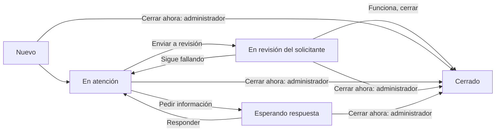

# Plan de rediseño compacto de incidencias

Estado: implementado y verificado. Fecha: 28/09/2026.

## Resultado buscado

Que Diego pueda revisar una tabla de tickets, abrir uno y encontrar inmediatamente «Enviar a revisión» y «Cerrar ahora». Carolina Ibarra sigue siendo la solicitante de las 8 incidencias importadas y Diego su responsable. El solicitante entiende qué debe hacer y puede confirmar el cierre o devolver el caso si sigue fallando.

«Cerrar automáticamente si considero que debe quedar cerrado» se interpreta como cierre inmediato decidido por el administrador, sin esperar confirmación del solicitante. No se incorpora un cierre por vencimiento o por falta de respuesta.

El rediseño reduce espacios, tarjetas anidadas, mensajes repetidos y controles secundarios siempre abiertos. Mantiene imágenes, trazabilidad, permisos y datos existentes.

## Diagnóstico del código y las capturas

- `TicketList.tsx` presenta cada ticket como un bloque de aproximadamente 130 px, con datos apilados y sin encabezados de columnas.
- `SupportShell.tsx` repite título, subtítulo, navegación y cabecera de bandeja, con márgenes amplios. El ancho máximo y los rellenos reducen el espacio útil.
- `TicketDetail.tsx` pone el formulario de acciones después de toda la conversación. «Solicitar prueba de la solución» y «Cerrar administrativamente» están dentro de un selector genérico «Acción».
- La revisión solo se ofrece para `in_progress`. Un ticket nuevo exige primero «Tomar incidencia» o asignación, aunque el administrador ya tenga una solución.
- La base ya admite cierre administrativo de tickets abiertos mediante `close_admin`, cancelando la solicitud pendiente. No falta la capacidad de cierre: falta una entrada clara.
- Los eventos se muestran del más antiguo al más reciente en tarjetas grandes. Las importaciones repiten descripción, procedencia y solicitud de prueba; las asignaciones ocupan casi el mismo espacio que un mensaje.
- Los datos y formularios laterales son una lista vertical extensa. La prioridad sugerida se muestra incluso si coincide con la actual.

## 1. Bandeja en tabla

### Estructura

Usar una tabla HTML real, con encabezados, filas compactas y enlaces accesibles al ticket. Columnas de escritorio:

| Columna | Contenido |
| --- | --- |
| Ticket | Código discreto y asunto; asunto completo al abrir o enfocar su ayuda |
| Estado | Etiqueta breve; una segunda línea solo cuando haya una acción pendiente: «Carolina debe probar» |
| Solicitante | Nombre de quien informó el caso |
| Responsable | Nombre del responsable o «Sin asignar» |
| Sector | Sector responsable; el módulo queda en el detalle |
| Prioridad | Baja, Media, Alta o Crítica |
| Actualización | Fecha breve; fecha y hora completas accesibles |
| Acciones | Menú «…» con acciones permitidas para ese usuario y estado |

Objetivo: filas de 44–56 px y al menos 8 tickets visibles en una ventana de 1440 × 900 a zoom 100 %, con el menú lateral cerrado. Títulos de hasta dos líneas cuando sea necesario; no reducir el texto a un tamaño ilegible para alcanzar la densidad.

Cabecera única: «Incidencias», navegación y botón «Nuevo ticket». Quitar el subtítulo decorativo y evitar un segundo bloque grande con el mismo propósito. Contenido a todo el ancho disponible, sin alterar los márgenes globales del ERP.

Vistas de gestión: Todas, A mi cargo, Sin asignar, Esperando solicitante y Cerradas. La primera entrada permanece en Todas, para no volver a ocultar los tickets importados. En Mis solicitudes: Todas, Requieren mi acción y Cerradas.

Barra de filtros de una línea: búsqueda, estado y sector; prioridad y filtros secundarios dentro de «Más filtros». Mostrar los filtros activos y «Limpiar» cuando corresponda. Conservar filtros y página al volver del detalle, preferentemente en parámetros de URL, sin persistir contenido sensible.

El menú por fila permite Abrir, Enviar a revisión o Cerrar ahora según permiso/estado. Las dos últimas abren el mismo diálogo que el detalle, con el código y asunto visibles. Ningún cambio de estado ocurre con un clic accidental sobre la fila. No agregar cierre masivo en esta etapa.

### Adaptación

- Desde 1280 px de ancho útil: columnas completas.
- En anchos intermedios: mantener Ticket, Estado, Solicitante y Acciones; responsable/sector/prioridad accesibles mediante expansión compacta de la fila.
- En móvil: tabla reducida Ticket / Estado / Acciones, con expansión para el resto; sin desbordar toda la página ni volver a tarjetas enormes.
- Controles de 32–36 px en escritorio y objetivos táctiles de al menos 44 px en móvil. Foco visible, nombres accesibles para iconos, contraste suficiente y estados comprensibles sin depender del color.

## 2. Detalle con acciones visibles arriba

Primera franja: Volver, código, título y estado. A su derecha, acciones del usuario actual. Esta barra permanece visible al desplazarse, debajo de la cabecera del ERP.

Segunda franja: datos en columnas, no en una lista lateral:

| Solicitante | Responsable | Sector | Prioridad |
| --- | --- | --- | --- |
| Carolina Ibarra | Diego Bóveda | TI / Sistemas | Media |

Una línea compacta indica la próxima acción: «Carolina debe probar la solución» o «Diego debe atender el ticket». Si no hay responsable, «Pendiente de asignación». No confundir al responsable permanente con la persona que debe actuar ahora.

Después, dos columnas en escritorio: descripción y adjuntos a la izquierda (aproximadamente 40 %), conversación y respuesta a la derecha (60 %). En móvil se apilan. Ninguna columna reserva espacio si su contenido está vacío. Evitar contenedores con desplazamientos verticales independientes anidados.

La descripción larga permite «Ver descripción completa». Los detalles opcionales —pasos, esperado, obtenido, impacto, fecha de creación, módulo y tipo— se despliegan bajo «Más detalles». La prioridad sugerida solo aparece si difiere de la actual.

«Editar datos» abre un panel o diálogo compacto para responsable, clasificación y transferencia. Un solo guardado por operación coherente; no mezclar en una falsa transacción varias llamadas independientes. Si el panel combina acciones, implementar una operación atómica o mantener secciones con guardado explícito. Los botones quedan deshabilitados si no hay cambios.

## 3. Circuito explicado mediante acciones

El diagrama es para documentación y una ayuda breve opcional. La pantalla cotidiana muestra estado, próximo actor y botones, sin un diagrama permanente.

Cambiar únicamente etiquetas visibles: `waiting_validation` se presenta como «En revisión» y `waiting_requester` como «Esperando respuesta». Mantener los códigos almacenados y separar `closure_kind=validated` de `administrative`. No migrar estados existentes por cambios de texto.

### Acciones por rol y estado

| Situación | Responsable/gestor autorizado | Solicitante | Administrador |
| --- | --- | --- | --- |
| Nuevo | Tomar, Enviar a revisión, Pedir información | Comentar | Además, Cerrar ahora |
| En atención | Enviar a revisión, Pedir información, Comentar | Comentar | Además, Cerrar ahora |
| Esperando respuesta | Ver pedido, Retomar atención | Responder solicitud | Además, Cerrar ahora |
| En revisión | Ver instrucciones, Retomar atención | Funciona, cerrar / Sigue fallando | Además, Cerrar ahora |
| Cerrado | Reabrir según permiso vigente | Reabrir con motivo | Reabrir |
| Cancelado | Ver historial | Ver historial | Restaurar |

Pedir una acción, transferir, cancelar y restaurar permanecen en «Más acciones». No esconder Enviar a revisión ni Cerrar ahora en ese menú dentro del detalle. Un gestor que también sea solicitante conserva sus permisos válidos, sin mostrar controles contradictorios.

### Enviar a revisión

Botón visible en tickets nuevos o en atención. Diálogo «Enviar a revisión de Carolina» con dos campos cortos y obligatorios: «Qué se resolvió» y «Qué debe probar». Adjuntos opcionales con pegado de capturas. Botón final «Enviar a revisión».

Una sola operación guarda solución, instrucciones, adjuntos públicos, solicitud abierta para el solicitante y notificación interna. Si estaba sin responsable, asignar al gestor que ejecuta; si ya tenía responsable válido, conservarlo. Permitir la transición desde Nuevo sin exigir tomar el ticket antes: ampliar la operación existente `request_validation` de manera atómica. No encadenar `take` y `request_validation` desde el navegador.

Si ya está en revisión, indicar «Revisión solicitada a Carolina» y no crear otra solicitud. Para cambiar lo solicitado, usar Retomar atención con motivo y luego enviar una nueva revisión. Un comentario por sí solo no reemplaza instrucciones ni completa la solicitud pendiente.

### Cierre inmediato del administrador

Botón visible «Cerrar ahora» en todos los estados abiertos, incluso Esperando respuesta y En revisión. Diálogo breve con «Motivo del cierre» obligatorio y texto «Se cerrará sin esperar la confirmación de Carolina». El botón final confirma la acción; evitar una segunda confirmación del navegador.

Reutilizar `close_admin`: cerrar, guardar autor/fecha/motivo y cancelar la solicitud pendiente en la misma transacción. Mostrar después «Cerrado por Diego · sin validación del solicitante», sin sugerir que Carolina lo aprobó. Mantener disponible Reabrir. No crear una tarea programada de cierre automático.

### Respuesta del solicitante

En revisión: botones «Funciona, cerrar» y «Sigue fallando» en la franja superior. El primero requiere confirmación explícita y ejecuta `validate`; el segundo abre un campo de explicación y capturas opcionales y ejecuta `reject`. La devolución vuelve al responsable; si dejó de estar habilitado, regresa a Nuevo/Sin asignar según la lógica vigente.

Esperando respuesta: el formulario principal se titula «Responder solicitud», muestra el pedido que debe resolver y envía `respond`. El comentario común queda como una acción separada para no confundir comentar con responder.

## 4. Conversación e historial compactos

Separar lo que hay que leer de la auditoría completa, sin borrar datos:

- Pestaña predeterminada «Conversación»: mensajes humanos públicos y solicitudes/respuestas de trabajo, en filas simples con autor, fecha y texto. Más recientes primero, con formulario de respuesta por encima del listado y «Ver anteriores» al final.
- Pestaña «Actividad»: todos los eventos autorizados, con cambios de estado/asignación en una línea y expansión para ver el detalle. Identificar el tipo de cierre.
- Para gestores, notas internas dentro de una pestaña o filtro explícito «Notas internas». El editor conserva una selección inequívoca «Público / Interno»; nunca convertir un borrador interno en público por cambiar de estado o pestaña.
- Mostrar inicialmente hasta 20 registros por vista. La paginación debe aplicarse a la categoría en el servidor; filtrar solo los últimos 50 eventos descargados dejaría conversaciones aparentemente vacías.
- Las solicitudes de prueba y sus instrucciones se muestran una vez en el bloque de acción actual. En el historial se conserva una fila resumida expandible, sin repetir párrafos completos siempre abiertos.
- Los eventos `imported` se resumen como «Importado de la planilla · ID original 3». La información original queda accesible al desplegar; las notas internas de importación conservan su privacidad.
- Las imágenes importadas deben quedar visibles y accesibles aunque el evento de importación esté contraído. Mostrar una tira de miniaturas del reporte o el indicador «2 imágenes» con apertura directa; no perderlas al filtrar Conversación.
- Mensajes largos colapsados después de aproximadamente 4 líneas, con «Ver más». Evitar burbujas grandes, fondos por evento y tarjetas dentro de tarjetas.

No fusionar ni eliminar eventos persistidos para compactar. Cuando una asignación o clasificación no cambie valores, evitar una nueva escritura desde la interfaz. El servidor debe mantener idempotencia y se evaluará devolver sin nuevo evento ante una operación realmente idéntica; no suprimir cambios reales ni sus autores.

## 5. Estilo visual

- Espaciado base de 4/8 px; separación entre secciones de 12–16 px.
- Márgenes interiores de 12–16 px, bordes discretos y radios de 6–8 px.
- Cuerpo de 13–14 px en escritorio; metadatos de 12 px. En móvil, evitar campos inferiores a 16 px si provocan zoom al enfocar.
- Un solo color principal para acciones. Colores de estado suaves; reservar rojo para errores o cancelación, no para un cierre normal.
- Quitar el icono grande decorativo, sombras marcadas, grandes bloques amarillos y subtítulos repetidos.
- Descripción, solución, pendiente y actividad deben tener funciones claras; no mostrar el mismo texto en varios lugares abiertos.
- Alcance de estilos limitado al módulo de incidencias. No compactar todas las pantallas del ERP ni reemplazar sus componentes globales.

## 6. Implementación prevista

1. **Presentación y navegación:** ajustar `SupportShell.tsx`, reemplazar tarjetas de `TicketList.tsx` por tabla, mantener la entrada Gestión para gestores y Mis solicitudes para solicitantes. Agregar nombres y siguiente actor sin exponer directorios de usuarios a solicitantes.
2. **Detalle:** dividir `TicketDetail.tsx` en componentes pequeños de cabecera/acciones, datos, conversación y editor. Crear diálogos compartidos para acciones desde lista y detalle. Mantener todos los estados y borradores actuales.
3. **Contrato de acciones:** centralizar el cálculo de botones por rol/estado para evitar divergencias entre la tabla y el detalle. La autorización real sigue en servidor; ocultar un botón no reemplaza permisos.
4. **Consultas:** devolver nombres mínimos de participantes para los tickets de la página autorizada. Los responsables sectoriales no reciben hoy todos esos nombres con `support_me()` general; no resolverlo abriendo acceso global a perfiles. Añadir categorías de historial y cursores coherentes, manteniendo RLS y filtrado interno/público antes de paginar.
5. **Transición desde Nuevo:** nueva migración versionada posterior a las ya aplicadas; ampliar `support_command` para el envío atómico a revisión desde Nuevo, conservando firma, permisos, validaciones, claves idempotentes y control de versión. No editar v106/v107 como si no estuvieran aplicadas.
6. **Imágenes:** adaptar `AttachmentViewer.tsx` para miniaturas compactas y mantener el visor original, descarga autorizada, URLs privadas, revocación de blobs y límites existentes. El editor sigue admitiendo Ctrl+V.
7. **Documentación y verificación:** actualizar uso, etiquetas y pruebas que dependan de los títulos anteriores. Validar sobre casos sintéticos; no cerrar, reasignar ni reimportar los 8 tickets de Carolina durante las pruebas.

Ante un conflicto de versión, mantener el texto del usuario, recargar el estado y pedir que revise la acción. No reutilizar silenciosamente el formulario como otra acción porque desapareció la opción originalmente elegida. Mantener bloqueo de doble envío y exclusión de escritura durante suplantación.

## 7. Criterios de aceptación

- En escritorio, ver 8 filas sin el espacio vertical de las tarjetas actuales, con datos comparables por columnas.
- Al abrir un ticket en atención, Diego ve Enviar a revisión y Cerrar ahora sin desplazarse ni abrir un selector.
- En un ticket nuevo, enviar a revisión funciona en una sola operación y no deja un estado intermedio si falla.
- En los 6 casos importados pendientes de prueba, mostrar «En revisión» y «Carolina debe probar»; el botón Cerrar ahora sigue disponible para Diego.
- Carolina puede confirmar cierre o rechazar la prueba con explicación; el rechazo devuelve el caso a atención y conserva toda la conversación.
- Diego puede cerrar directamente un ticket esperando respuesta o prueba. Se cancela la solicitud abierta y se registra cierre administrativo, sin validación atribuida a Carolina.
- La incidencia ya cerrada sigue cerrada y visible al elegir Todas/Cerradas. Los IDs, solicitante, responsable, fechas y 2 imágenes de los 8 importados permanecen intactos.
- Una nota interna nunca se muestra al solicitante, ni en Conversación, ni en Actividad, ni al abrir un adjunto.
- Los gestores sectoriales solo ven tickets y nombres de participantes autorizados; otros solicitantes no acceden por listado, URL o archivo.
- El historial reducido permite recuperar todos los mensajes y eventos anteriores; la paginación de cada categoría funciona sin omisiones o duplicados.
- Probar en 1440 × 900, 1280 × 800, 768 px y 390 px: acciones visibles, texto legible, foco de teclado y sin desbordamiento de página.
- Probar idempotencia, solicitudes concurrentes, conflicto de versión y cambios de permisos con el diálogo abierto. Confirmar que los borradores no se pierden ni cambian de visibilidad.

La implementación pasó el circuito completo administrador → revisión del solicitante → cierre/rechazo y el cierre directo del administrador, usando cuentas ficticias eliminadas al finalizar. Se verificaron visualmente escritorio y móvil, 45 controles de aplicación, 41 controles SQL y 21 pruebas unitarias. La revisión de los 8 tickets de Carolina, sus 2 imágenes y sus permisos pasó sin modificar permanentemente los estados históricos.
