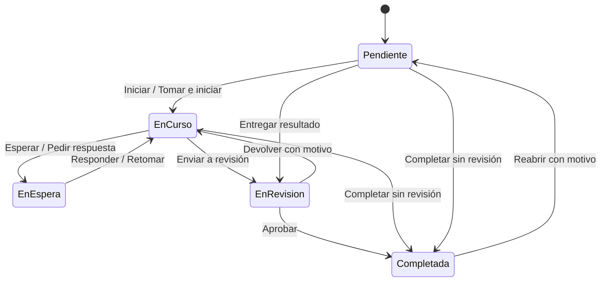

# Módulo independiente de Tareas — especificación para implementación

Fecha: 29/09/2026. Estado: diseño propuesto, listo para implementar por otro modelo. Este documento no crea tareas reales, no cambia la base y no autoriza por sí mismo una publicación.

## 1. Objetivo y decisiones de producto

Construir un módulo transversal del ERP para organizar trabajo de la empresa: tareas personales, tareas de un área, tareas delegadas, revisiones y rutinas recurrentes. Debe poder usarse sin que exista una incidencia.

Una incidencia, venta o compra puede originar o vincularse con tareas; ninguna de esas entidades es el contenedor obligatorio de las tareas. Una tarea conserva identidad, responsable, fechas, estado e historial propios. Completar una tarea no cierra automáticamente una incidencia, no confirma una venta ni modifica una compra.

Decisiones base que el ejecutor debe respetar:

- Entrada propia **Tareas** en el menú general del ERP y rutas `/tareas`. No ubicarla como subpestaña de Incidencias.
- Primera pantalla **Pendientes**, con trabajo que requiere la acción del usuario actual. El administrador también entra aquí; su rol no convierte todo el trabajo de la empresa en trabajo suyo.
- **A mi cargo** permite seguir tareas asignadas al usuario aunque esté esperando a otra persona.
- **Del área** permite atender trabajo dirigido a un área, incluyendo tareas sin persona asignada. **Equipo** permite supervisión según permisos.
- Un responsable individual como máximo por tarea. Puede coexistir con un área propietaria. Los colaboradores no son responsables equivalentes.
- Estados y acciones comunes para toda la empresa. No ofrecer un constructor de flujos por área en la primera versión.
- Tablero Kanban y lista son dos vistas de las mismas tareas, filtros y permisos; no crear registros duplicados por vista.
- La recurrencia produce instancias independientes y auditables. Nunca reabrir la misma tarea periódicamente borrando su historia.
- Primera entrega útil completa: tareas independientes, áreas/personas, Kanban/lista, revisión, vinculación con incidencias y recurrencias. Las integraciones específicas con ventas/compras se implementan después sobre contratos ya definidos.

Lo potente estará en el modelo y las reglas; la pantalla cotidiana debe tener pocas decisiones visibles.

Ejemplos de uso que deben resultar naturales:

1. **Trabajo independiente:** una coordinadora crea «Reorganizar ubicación de repuestos», la dirige a Depósito y un miembro la toma. No hay incidencia ni documento comercial obligatorio.
2. **Desde una incidencia:** el gestor crea «Corregir transferencia entre cuentas» y «Verificar el resultado» como tareas vinculadas. La incidencia mantiene su propio circuito de validación; los responsables de las tareas pueden ser distintos.
3. **Revisión delegada:** quien ejecuta entrega el trabajo a una revisora. Sigue siendo responsable, pero la siguiente acción aparece en la bandeja de ella.
4. **Rutina:** «Controlar matafuegos el primer día de cada mes» genera una instancia por mes para Mantenimiento, con checklist y vencimiento. Una instancia atrasada no reemplaza la del mes siguiente.
5. **Compra futura:** desde una orden se podrá crear «Verificar diferencias en recepción», dirigida a Compras o a una persona del área. La tarea no cambia cantidades, deuda ni estado de la orden por completarse.

## 2. Contexto comprobado en este repositorio

El ERP utiliza Next.js App Router, React, TypeScript, Tailwind y Supabase. En el código revisado, `sellers` también contiene personal con distintos roles del ERP; no se debe interpretar su nombre como una restricción a vendedores comerciales.

Incidencias tiene un modelo propio: `support_profiles` vincula `auth.users` con `sellers`; `support_sectors` y `support_sector_members` determinan sectores y gestión de soporte. Existe versionado, idempotencia, eventos, notificaciones y RLS. Esas técnicas sirven de referencia, pero sus permisos no son los permisos de Tareas.

Referencias iniciales para el ejecutor:

| Archivo o directorio | Para qué revisarlo |
| --- | --- |
| `src/lib/support/types.ts`, `actions.ts` | Estados existentes, distinción entre responsable y próximo actor |
| `src/lib/support/server.ts`, `client.ts` | Autenticación, sesión, impersonación y respuestas privadas |
| `src/app/api/support/[...path]/route.ts` | Lecturas paginadas y contrato de operaciones |
| `database/db_migration_v106_support_tickets.sql` | Identidades, RLS, RPC, eventos e idempotencia de soporte |
| `database/db_migration_v109_support_compact_workflow.sql` | Transiciones actuales de incidencias |
| `src/components/support/TicketActionDialog.tsx` | Diálogo centrado y edición inmediata ya corregidos |
| `src/components/support/useRefreshSignal.ts` | Refresco al volver a la pestaña y pausa durante edición |
| `src/lib/erpNavigation.ts`, `src/components/ui/AdminLayout.tsx` | Integración en navegación y layout |
| `src/app/admin/vendedores/page.tsx`, `src/lib/userRoleProfile.ts` | Personal activo, identidad y roles existentes |
| `database/db_migration_v74_order_sync_inbox.sql` | Antecedente de programación en servidor con `pg_cron` |
| `database/db_migration_v60_purchase_orders_schema.sql` | Referencia futura de compras; confirmar esquema real antes de integrar |

El commit `2aec354982646e141573335b2d3a9283f073f3e4` publicó los últimos ajustes de incidencias de esta conversación: pendientes propios y diálogo de cierre. El ejecutor debe comprobar la rama remota actual, no usar ese commit como si siempre fuera la última versión.

La carpeta principal contiene numerosas modificaciones de otras tareas y archivos sin seguimiento. Preparar la implementación sobre una base remota actual y preservar esos cambios. No copiar todo el árbol local ni desplegarlo completo por conveniencia. Los planes antiguos de incidencias que dicen entrar en «Todas» quedaron superados por las decisiones posteriores.

## 3. Conceptos e identidad

**Tarea:** una unidad de trabajo con un resultado verificable. Código `TAR-000123`, título, descripción opcional, propietario, estado, prioridad y fechas opcionales.

**Área propietaria:** área que responde organizativamente por el trabajo. Puede tener varios miembros y uno o más coordinadores. Ejemplos iniciales para configurar, no para crear ciegamente: Administración, Ventas, Compras, Logística, Depósito, Producción, Mantenimiento y Sistemas.

**Responsable:** persona a cargo de ejecutar y dar seguimiento. Puede conservar esa responsabilidad mientras otro revisa o responde.

**Próximo actor:** persona o área a la que corresponde la siguiente acción. Se deriva del estado y de una solicitud de acción vigente; no inferirlo solo a partir del responsable.

**Colaborador:** persona autorizada a leer, comentar y participar en el checklist. Su participación no mete automáticamente la tarea en sus Pendientes ni le permite reasignarla.

**Rutina:** plantilla con una programación que genera tareas. La rutina y cada instancia tienen permisos, estados e historial propios.

**Vínculo:** relación tipada con un registro externo al módulo, inicialmente una incidencia. Una tarea admite varios vínculos y una incidencia varias tareas.

### Identidad del personal

Reutilizar el directorio existente, con una tabla de correspondencia `task_people` si no hay ya una identidad transversal adecuada. Campos mínimos: `id`, `seller_id` único y `user_id` único nullable. Nombre y actividad se obtienen del directorio, no de una copia editable de nombres y correos.

No asumir que `seller_id = auth.uid()`. Resolver correspondencias verificadas; evitar vincular cuentas por coincidencias parciales de email. Detectar y reportar ambigüedades en el alta/migración.

Permitir asignar a personal registrado sin cuenta de acceso, identificado como **Sin acceso al ERP**. Esa persona no recibe una bandeja ni notificaciones de usuario ficticias. Si no tiene cuenta, exigir área propietaria y un coordinador activo con acceso; el coordinador registra sus avances. Para delegar una respuesta o revisión digital sí se requiere destinatario con acceso activo. No crear cuentas ni invitaciones automáticamente.

Las áreas de Tareas tienen miembros y coordinadores propios. No reutilizar `support_sector_members` para agregar personal: en soporte esa pertenencia concede capacidad de gestionar incidencias. Se puede ofrecer una importación inicial explícita de nombres de sectores, sin copiar privilegios.

## 4. Navegación y pantallas

### Entrada y vistas

Cabecera compacta: **Tareas**, búsqueda y **Nueva tarea**. Debajo:

| Vista | Qué muestra |
| --- | --- |
| Pendientes — inicial | Acciones personales disponibles ahora; ejecución, respuestas y revisiones |
| A mi cargo | Tareas activas de las que soy responsable, incluidas las que esperan a otros o tienen inicio futuro |
| Del área | Tareas activas de mis áreas autorizadas; filtro «Sin asignar» y botón Tomar |
| Equipo | Trabajo dentro de mi alcance como coordinador/administrador, con filtros de persona y área |
| Finalizadas | Completadas y canceladas, separadas mediante filtro, dentro del mismo alcance autorizado |

**Rutinas** y **Configuración** se ubican en una navegación secundaria. Configuración solo aparece a quienes pueden administrar áreas/permisos. Dentro de filtros avanzados: Creadas por mí, Colaboro, Programadas y origen. No sumar pestañas para cada combinación.

No reabrir de forma automática en la última vista de Equipo al ingresar desde el menú: la entrada normal sigue siendo Pendientes. Los enlaces con filtros explícitos y el retorno desde una tarea conservan la vista que el usuario eligió.

Selector **Lista / Tablero** con preferencia personal. Lista por defecto en Pendientes para priorizar lo que requiere acción; Tablero por defecto en Del área y Equipo. Conservar búsqueda y alcance al alternar.

En Pendientes, distinguir con texto breve **Para hacer**, **Para responder** y **Para revisar**. Puede haber agrupación en la lista, pero no tres contadores grandes ni tres paneles adicionales.

### Reglas exactas de Pendientes

- Ejecución: usuario responsable, estado Pendiente o En curso, inicio alcanzado o sin inicio futuro.
- Respuesta: solicitud de acción abierta dirigida a la persona del usuario, estado En espera.
- Revisión: solicitud de revisión abierta dirigida a la persona del usuario, estado En revisión.
- Tareas dirigidas a un área sin persona: aparecen en Del área; no replicarlas como obligaciones personales de cada miembro.
- Tarea que yo asigné a otro: no aparece en mis Pendientes por el solo hecho de haberla creado.
- Tarea a mi cargo enviada a revisión de otro: sale de mis Pendientes y permanece en A mi cargo.
- Tarea bloqueada sin siguiente actor: se sigue en A mi cargo/Del área; no se presenta como trabajo ejecutable.
- Finalizadas y canceladas: excluidas de todas las vistas activas.
- Colaboradores y observadores no reciben pendiente salvo una solicitud explícita dirigida a ellos.

En móvil usar lista por defecto. Permitir consultar una columna del tablero por vez con selector; evitar comprimir cinco columnas ilegibles o producir desplazamiento horizontal de toda la página.

### Tablero Kanban

Columnas activas fijas: **Pendiente**, **En curso**, **En espera**, **En revisión**. **Completadas** se muestra solo al activar «Mostrar completadas recientes» y queda limitada/paginada. Canceladas van al historial de Finalizadas.

Cada tarjeta muestra título de dos líneas, responsable o área, vencimiento si existe y una línea contextual cuando espera una acción. Código, prioridad excepcional, checklist y vínculos como indicadores discretos. No llenar tarjetas con todos los campos ni usar varios colores de fondo por prioridad.

Arrastrar permite cambios válidos; ofrecer siempre menú **Mover a…** para teclado, móvil y accesibilidad. Un arrastre a En espera/Revisión abre el formulario mínimo si falta motivo o destinatario. No simular éxito antes de ese formulario. Soltar en Completadas respeta revisión y checklist obligatorios; no permite saltarse reglas.

Orden predeterminado: prioridad, vencimiento y antigüedad, con desempate estable por ID. No implementar orden manual persistente en la primera entrega; al soltar, la tarjeta se acomoda en el orden establecido. Evita conflictos de ordenamiento y permite la misma lectura en lista. Si se pide orden manual después, tendrá alcance explícito por tablero y columna.

Contadores de columna calculados en servidor con los mismos filtros y permisos. Cargar 30 tarjetas por columna, con «Cargar más» independiente. No descargar miles de tareas para filtrar en el navegador.

### Nueva tarea y detalle

Creación rápida: título enfocado inmediatamente, área/persona, vencimiento opcional y Crear. Descripción, revisión, checklist, vínculos y repetición dentro de «Más opciones». Título y al menos un destino son obligatorios. Para una tarea personal, preseleccionar al usuario actual; crear para otro requiere permiso.

Detalle en panel amplio en escritorio y pantalla completa en móvil, con URL propia `/tareas/[id]`, acceso directo y retorno con filtros. Una barra presenta estado, próximo actor y una acción principal contextual. Metadatos editables compactos, luego descripción, checklist, vínculos y conversación/actividad.

Diálogos cortos centrados, visibles dentro del viewport, con foco inicial útil y retorno de foco al cerrar. Se puede redactar mientras se verifica contexto; confirmar queda bloqueado hasta autorización. No bloquear el textarea esperando una petición de red ni agregar demoras artificiales.

Creación, comentarios y transiciones usan guardado explícito. Proteger borradores sin sobrescribirlos por refresco. Mostrar «Guardando…» y conservar contenido ante error. Actualización optimista solo en acciones simples reversibles, con restauración al fallar y respuesta canónica del servidor.

## 5. Estados y transiciones

Estados técnicos: `todo`, `in_progress`, `waiting`, `in_review`, `done`, `cancelled`. `overdue` y `scheduled` son condiciones calculadas, no estados adicionales.

Todas las transiciones se validan en el servidor y la base; el menú del cliente es una representación de las acciones devueltas por el servidor.

| Acción | Requisitos y resultado |
| --- | --- |
| Tomar | Miembro habilitado del área; tarea sin responsable. Asigna al actor. No cambia estado salvo «Tomar e iniciar» explícito |
| Iniciar | Responsable activo; Pendiente → En curso. No exige comentarios |
| Pedir respuesta | Motivo/pregunta y destinatario persona o área. Crea solicitud abierta y pasa a En espera |
| Marcar en espera | Motivo obligatorio; espera externa o bloqueo sin destinatario. Recordatorio opcional |
| Responder | Solo destinatario vigente o miembro habilitado del área destinataria; cierra solicitud y retorna al trabajo del responsable |
| Retomar | Responsable/coordinador; cancela solicitud pendiente con motivo y vuelve a En curso, o Pendiente si falta responsable válido |
| Enviar a revisión | Resultado breve y revisor/destino autorizado; checklist obligatorio completo. Crea solicitud y pasa a En revisión |
| Aprobar | Revisor autorizado; completa con autor/fecha. Si la revisión es por área, cualquier revisor habilitado puede resolverla; el primero gana |
| Devolver | Revisor; motivo obligatorio. Cancela/cierra solicitud y vuelve al responsable para corregir |
| Completar | Responsable o coordinador; si exige revisión, se interpreta como Enviar a revisión. No se aprueba a sí mismo |
| Cancelar | Creador autorizado, coordinador o administrador; motivo y cancelación de solicitud abierta |
| Reabrir | Coordinador, administrador o creador de su tarea personal; motivo. Conserva historial y versión; no genera otra instancia recurrente |
| Reasignar/transferir | Permiso en origen y capacidad para asignar en destino; mantiene historia y notifica a responsables afectados |

Revisión opcional por tarea, desactivada por defecto. Si se activa, debe existir revisor distinto del responsable o un área con revisores habilitados. Si el responsable es parte del área revisora, no puede aprobar su propia entrega. No heredar automáticamente al solicitante de la incidencia como revisor de la tarea.

Una sola solicitud abierta por tarea, sea respuesta o revisión. Nuevos comentarios no satisfacen esa solicitud: usar Responder/Aprobar/Devolver. La misma operación cambia estado, solicitud, evento y notificaciones.

Si el destinatario o responsable se desactiva, conservar su identidad histórica y quitarle acceso efectivo. La tarea se deriva a la coordinación del área para reasignación; las tareas personales sin área quedan en una cola administrativa. Una solicitud a una persona desactivada queda marcada como no atendible y debe retargetearse/cancelarse en una operación auditada; no dejarla silenciosamente bloqueada.

### Checklist y subtareas

Checklist desde la primera versión: texto, orden, completado por/fecha y marca «Obligatorio para completar». Los colaboradores pueden marcar ítems si tienen permiso operativo. Cada cambio relevante conserva trazabilidad.

Una subtarea real tiene responsable/fecha/estado propios y relación `parent_task_id`. Implementarla en una fase posterior, máximo un nivel inicialmente. No convertir cada ítem del checklist en una tarea ni permitir ciclos. El cierre de un padre con subtareas activas exige una regla explícita; cuando se habiliten, bloquear por defecto y ofrecer cancelación/cierre separado, sin cascadas ocultas.

## 6. Destinos y permisos

Destinos admitidos: persona sin área para trabajo personal; área sin persona para una cola compartida; área y persona para trabajo asignado. En tareas de área, el responsable debe ser miembro activo del área. Una colaboración desde otra área se agrega explícitamente sin cambiar el propietario.

Cada área tiene miembros con rol `member` o `coordinator`. Las facultades de asignar, revisar y administrar rutinas se definen en ese ámbito. Un rol del ERP como Compras no concede por sí solo control de todas las tareas; mapearlo a pertenencias iniciales solo mediante configuración explícita.

| Actor | Alcance |
| --- | --- |
| Usuario activo | Crear trabajo personal, ejecutar lo asignado, responder/revisar solicitudes dirigidas a él |
| Miembro de área | Ver tareas del área de visibilidad Área, tomar las de la cola y colaborar según permisos |
| Coordinador | Asignar, revisar, transferir dentro de permisos, consultar equipo y administrar rutinas del área |
| Administrador de Tareas | Configurar áreas y roles, resolver tareas huérfanas, auditoría dentro del módulo |
| Creador | Leer el seguimiento de lo que creó y comentar; no obtiene permiso ilimitado para cambiar trabajo delegado |
| Colaborador | Leer/comentar y operar checklist; no asignar, cancelar o aprobar por defecto |

Visibilidad inicial con dos opciones: **Área** (predeterminada cuando tiene área) y **Participantes** (predeterminada si es personal). En Área leen los miembros activos del área, participantes y coordinación. En Participantes leen creador, responsable, destinatario de acción, colaboradores explícitos y coordinación del área. El administrador del módulo tiene acceso auditado. Evitar permisos distintos por comentario en la primera versión: todos los comentarios de una tarea comparten su audiencia.

Los destinatarios de una solicitud obtienen acceso mientras la solicitud esté abierta; no se convierten automáticamente en participantes permanentes. Al finalizar, pierden ese acceso si no tenían otro motivo de lectura. Sus acciones permanecen en el historial visible a los participantes vigentes.

Un creador común solo puede asignarse a sí mismo o enviar a la cola de un área que acepte solicitudes internas. Elegir arbitrariamente a cualquier empleado requiere coordinación/administración. La selección muestra solo destinos realmente permitidos.

RLS también cubre checklist, comentarios, adjuntos, vínculos, eventos, notificaciones y métricas. Toda búsqueda y contador usa el mismo alcance. Las rutas bajo impersonación son de solo lectura, como en soporte. La clave de servicio se reserva para trabajo de servidor controlado y nunca reemplaza la autorización de peticiones ordinarias.

## 7. Vinculación con incidencias y otros módulos

Desde una incidencia: botón **Crear tarea** y bloque **Tareas vinculadas**. La creación abre un borrador editable con título/descripción propuestos y vínculo de origen. No crea nada hasta confirmar. Ofrecer también **Vincular tarea existente**, buscando solo tareas que el usuario pueda vincular.

El formulario muestra quién podrá leer el contenido de la tarea. Copiar únicamente contenido seleccionado y autorizado; no arrastrar notas internas, adjuntos o conversación completa. Los adjuntos del origen se consultan con permisos del origen; si se implementa «Copiar adjunto», será una operación explícita que genere un nuevo objeto privado y deje registro.

Crear tarea + guardar vínculo debe ser una transacción idempotente. Tras confirmarse, mostrar el código de la tarea y acceso al detalle. La incidencia conserva su estado y su responsable; una tarea puede asignarse a un área distinta con autorización y contenido apto para esa audiencia.

La tarjeta de un vínculo solo presenta título, código, ruta y resumen si el usuario también puede leer el origen. Sin permiso: omitir sus datos y mostrar, solo si es necesario, «Registro vinculado sin acceso». No filtrar información mediante buscador, número de vínculos, métricas, errores, notificaciones o snapshots. La existencia del vínculo no otorga acceso al origen, ni leer una incidencia da acceso a todas sus tareas.

En la incidencia, mostrar únicamente tareas que el lector pueda leer; no revelar un total global de tareas ocultas. Para el gestor con alcance completo, permitir consultar pendientes y completadas vinculadas.

Al completar todas las tareas visibles no afirmar que la incidencia está resuelta: podría haber otras tareas o faltar validación. Solo un gestor con capacidad de comprobar el conjunto completo recibe una sugerencia **Revisar incidencia para cierre**, que utiliza el circuito existente. Si la incidencia se cierra con tareas activas, estas continúan; avisar a sus responsables y dejar la decisión de cancelarlas/completarlas explícita.

### Contrato de integraciones

Crear un registro de adaptadores en servidor, inicialmente `support_ticket`. Futuras claves: `sales_order` y `purchase_order`, tras verificar entidades y permisos reales.

Cada adaptador implementa: validar ID, comprobar lectura, comprobar permiso de vincular, buscar candidatos permitidos, resolver tarjeta mínima, proponer un borrador y construir una ruta conocida. El cliente no proporciona SQL, tabla, URL arbitraria ni un permiso calculado por él.

Persistencia recomendada: `task_links` con `kind` y referencia tipada, empezando con `support_ticket_id` como FK. Ampliar mediante migraciones con FKs de ventas/compras y un CHECK de exactamente una referencia acorde al tipo. Un índice único impide duplicar el mismo vínculo en la misma tarea. No crear FKs imaginadas antes de comprobar tablas e IDs.

Futuras automatizaciones por eventos de otros módulos usarán una outbox y una clave única `(rule_id, source_event_id)`. Ejemplo: venta confirmada genera «Verificar entrega»; recepción de compra genera «Controlar mercadería». La tarea es un efecto secundario reintentable, no una condición para confirmar la operación comercial. No implementar estas reglas comerciales en la primera entrega.

## 8. Rutinas y recurrencia

Pantalla **Rutinas**: nombre, destino, frecuencia legible, próxima generación, estado y última ejecución. Botones Crear rutina, Pausar/Reanudar y Editar. Las tareas generadas se operan en el módulo normal y tienen un enlace a su rutina.

Formulario en lenguaje cotidiano:

- Qué hay que hacer: título, instrucciones y checklist plantilla.
- Quién: persona, área o ambas; revisión opcional con destinatario.
- Cuándo: cada N días; cada N semanas con días elegidos; cada N meses en día determinado o último día; cada N años; o N días después de completar.
- Hora y zona horaria: predeterminada `America/Argentina/Buenos_Aires`, mostrada de forma discreta y editable en opciones avanzadas.
- Primera fecha, fin opcional por fecha o cantidad y plazo para completar.
- «Crear con anticipación»: por defecto 0 días; permite preparar una tarea futura con fecha de inicio en la ocurrencia prevista.
- Vista previa obligatoria de las próximas cinco fechas y ejemplo de vencimiento antes de guardar.

Persistir una regla estructurada y validada. No mostrar RRULE ni sintaxis cron al usuario. El ejecutor puede emplear una biblioteca mantenida si verifica compatibilidad y tamaño con el runtime; no construir cálculos mensuales sumando 30 días ni horarios locales sumando 24 horas UTC.

### Calendario frente a después de completar

**Por calendario:** cada ocurrencia tiene fecha propia aunque la anterior siga abierta. Ejemplo: «Revisar caja todos los lunes». Instancias de semanas distintas no se fusionan. Resaltar atrasos acumulados en Rutinas, sin detener silenciosamente la programación.

**Después de completar:** solo una instancia activa. La siguiente fecha se calcula a partir de la finalización real, respetando horario/zona. Cancelar una instancia pausa la rutina con aviso para decidir cómo continuar. Reabrir una instancia histórica no genera una nueva ocurrencia ni borra una ya generada.

Reglas de borde obligatorias:

| Situación | Comportamiento |
| --- | --- |
| Mensual en día 29, 30 o 31 inexistente; anual el 29/2 en año no bisiesto | Usar último día del mes previsto; describirlo en la vista previa |
| Horario inexistente por cambio de zona | Primer horario válido posterior; una ocurrencia |
| Horario duplicado por cambio de zona | Primera ocurrencia local; nunca duplicar tareas |
| Varias ejecuciones del worker | Una instancia por clave de ocurrencia |
| Worker caído | Recuperar ocurrencias vencidas por lotes; no perderlas ni hacer una creación ilimitada en una ejecución |
| Rutina pausada | No generar; las tareas ya creadas continúan |
| Reanudar | Por defecto continuar desde la próxima fecha futura. Ofrecer recuperar fechas omitidas de forma explícita |
| Editar rutina | Afecta próximas ocurrencias no materializadas. Las tareas existentes conservan su snapshot |
| Cambio de responsable en rutina | Cambia solo instancias futuras; reasignar activas es una operación aparte |
| Responsable desactivado | Generar a la cola del área si existe coordinación habilitada; si no, bloquear generación y notificar a administradores |
| Error en una rutina | Registrar fallo y reintentar con demora; no impedir procesar las demás |

Los ajustes de calendario son días calendario en la primera entrega. «Días hábiles» y feriados empresariales quedan fuera hasta que exista un calendario explícito; lunes a viernes es una selección semanal, no un cálculo de feriados.

### Generador en servidor

Usar un job periódico en servidor; nunca depender de tener una pestaña abierta. El repositorio tiene antecedentes con `pg_cron`; verificar disponibilidad real antes de activarlo. Para reglas calculadas en SQL, función privada invocada por cron; para cálculo en TypeScript, worker autenticado despachado por el programador. Elegir una sola fuente de generación y documentarla.

Protocolo requerido: reclamar rutinas vencidas con bloqueo/lease, calcular ocurrencia, insertar ledger de ocurrencia y tarea en una transacción, avanzar cursor y guardar resultado. Restricción única de base como defensa final, incluso ante dos workers o un reintento tras timeout. Si el cálculo ocurre fuera de la transacción, confirmar también versión/lease de la rutina antes de materializar.

El ledger identifica `(routine_id, schedule_revision, occurrence_key)`, pero cambiar la revisión no puede duplicar una fecha ya materializada: al editar, fijar frontera efectiva y no regenerar ocurrencias pasadas/existentes. Registrar cambios y últimas fechas materializadas. Limitar a 50 ocurrencias por lote, continuar desde cursor y aplicar backoff a fallos repetidos.

Para rutinas de calendario, añadir además unicidad de `(routine_id, scheduled_for)` entre revisiones. La edición se confirma con bloqueo de la rutina y fija su frontera después de la última ocurrencia ya creada, incluidas las generadas con anticipación. Mostrar esa fecha efectiva al editar para que no parezca que cambian tareas existentes. En modo después de completar, usar como identidad de la siguiente ocurrencia la instancia anterior, no la hora en que el worker intentó crearla.

Registrar ejecución, duración, tareas generadas, atrasos y último error sin secretos. Añadir una vista administrativa de fallos recuperables con Reintentar. Habilitar el job solo después de verificar generación e idempotencia en un entorno de prueba.

## 9. Modelo de datos propuesto

Nombres orientativos; conservar las responsabilidades aunque el ejecutor adapte nombres al repositorio. Usar UUID, marcas temporales `timestamptz`, restricciones y FKs reales. No almacenar nombres como autoridad de identidad.

| Entidad | Campos principales / invariantes |
| --- | --- |
| `task_people` | ID, vínculo único al personal, vínculo opcional único a auth; actividad derivada/verificada |
| `task_areas` | Nombre único normalizado, activo, permite solicitudes internas |
| `task_area_members` | Área/persona únicos, rol miembro/coordinador, activo, capacidad de revisión |
| `task_admins` | Persona, activo, autor/fecha del permiso; inicialización explícita desde administradores verificados |
| `tasks` | ID, número identity único, título, descripción, estado, prioridad, área, responsable, creador, visibilidad, inicio, vencimiento, versión, revisión requerida/destino, resultado, finalización/cancelación |
| `task_participants` | Tarea/persona únicos, tipo colaborador; acceso explícito, autor/fecha |
| `task_action_requests` | Tipo respuesta/revisión, destinatario persona XOR área, texto, estado, emisor, respuesta/resultado; índice único parcial de una abierta por tarea |
| `task_checklist_items` | Tarea, texto, posición, obligatorio, completado por/fecha, versión propia |
| `task_comments` | Tarea, autor, cuerpo, fecha, edición auditada; sin borrar conversaciones por cambio de estado |
| `task_attachments` | Objeto privado, tarea/comentario, autor, MIME, tamaño, estado de reserva/vinculación |
| `task_links` | Tarea, tipo y FK tipada de origen, autor/fecha; sin caché pública de títulos privados |
| `task_events` | Tarea/rutina, tipo, actor humano o sistema, antes/después mínimo, fecha, operación de origen |
| `task_notifications` | Destinatario, evento, tarea/rutina, leído; clave de deduplicación |
| `task_operations` | Actor, clave idempotente, hash/payload de solicitud, resultado, fecha |
| `task_routines` | Plantilla validada, programación, zona, revisión de calendario, próxima ejecución, modo, activo/pausado, creador, permisos, versión |
| `task_occurrences` | Rutina, revisión, clave, fecha prevista, tarea generada o motivo de omisión/fallo |
| `task_job_runs` | Ejecución/lease, estado, tiempos, cursor/contadores, error acotado |

En `tasks`, al menos área o responsable. `in_progress` requiere responsable válido; `in_review` exige solicitud de revisión abierta; `waiting` requiere motivo y puede tener solicitud de respuesta. `done` exige autor/fecha/resultado según plantilla. Evitar dos fuentes editables para próximo actor: derivarlo desde estado y solicitud; si se materializa para índices, mantenerlo solo transaccionalmente.

Fechas: almacenar instantes en UTC y zona en rutina. Para un vencimiento elegido solo como fecha, definir semántica local consistente: vence al finalizar ese día en la zona de la tarea; devolver fecha y zona sin convertirlo visualmente al día anterior. No mezclar fecha sin hora con UTC a medianoche de forma implícita.

Índices iniciales según consultas: responsable/estado/inicio; área/estado; solicitudes abiertas por destinatario; vencimiento de tareas activas; `(updated_at,id)` para cursores; vínculos por origen; notificaciones por usuario/leído; rutinas activas por próxima ejecución. Revisión con planes de consulta sobre datos representativos antes de añadir índices redundantes.

## 10. API, transacciones y concurrencia

Rutas sugeridas bajo `/api/tasks`, separadas de `/api/support`. Factorizar autenticación compartida solo si se preserva el comportamiento de ambos módulos; no llamar a `support_is_active` para admitir a un usuario en Tareas.

| Operación | Contrato |
| --- | --- |
| `GET /api/tasks/me` | Identidad, áreas y capacidades efectivas; destinos permitidos paginados por endpoint aparte |
| `GET /api/tasks` | Vista, área, responsable, estado, prioridad, texto, origen, fechas y cursor |
| `GET /api/tasks/board` | Totales y primera página por columna con el mismo alcance/filtros |
| `POST /api/tasks` | Crear con checklist y vínculos iniciales de forma atómica |
| `GET /api/tasks/:id` | Detalle autorizado, acciones permitidas y próximo actor |
| `POST /api/tasks/:id/commands` | Comando, versión esperada, clave idempotente y payload validado |
| `GET/POST /api/tasks/:id/comments` | Conversación paginada y nuevo comentario |
| `GET /api/tasks/:id/events` | Actividad paginada |
| `GET/POST /api/tasks/routines` | Listado y creación autorizada |
| `POST /api/tasks/routines/:id/commands` | Editar, pausar, reanudar, previsualizar y reintentar según permiso |
| `GET /api/tasks/link-candidates` | Búsqueda autorizada por adaptador y tipo permitido |

Los detalles de rutas pueden usar un handler catch-all como soporte, pero los contratos deben seguir separados. Respuestas privadas `no-store`; nada de caché compartida de tareas entre usuarios.

Comandos mínimos: `update`, `assign`, `take`, `start`, `request_response`, `wait`, `respond`, `resume`, `request_review`, `approve`, `reject`, `complete`, `cancel`, `reopen`, `transfer`, `link`, `unlink`, `add_participant`, `remove_participant`. Operaciones de checklist/comentarios pueden usar versiones propias para no producir conflictos innecesarios con cada edición de texto.

Bloquear fila, validar versión y permisos, ejecutar cambios, emitir evento/notificaciones y guardar resultado idempotente en la misma transacción. RPC de escritura sin privilegios de tablas abiertos al cliente. Funciones `security definer` con `search_path` seguro, nombres cualificados y permisos mínimos; no confiar en user_id enviado por el cliente.

Reintentar la misma clave/payload devuelve el resultado original. Reutilizar clave con otro payload falla. Dos miembros tomando una tarea producen un ganador y un conflicto comprensible. Un HTTP 409 conserva borrador y muestra datos actuales; no reintentar automáticamente un movimiento que ya no cumple su intención.

Para listar, usar paginación por cursor y desempate estable. Los filtros se aplican antes de paginar. Rechazar cursores inválidos y filtros fuera de catálogo. Cambiar filtro elimina el cursor. Evitar consultas N+1 a personas y vínculos; devolver resúmenes autorizados por lotes.

## 11. Avisos y seguimiento

Notificaciones internas en el ERP al asignar, solicitar respuesta/revisión, devolver, mencionar y quedar una rutina sin destino atendible. No notificar al propio actor por su propia operación. Deduplicar por destinatario y evento/ventana de recordatorio.

Al acercarse o superar el vencimiento, un aviso por umbral configurado; no uno por ejecución del job. Un solo indicador discreto en Tareas para pendientes propios, y avisos de coordinación separados. Marcar leído no equivale a completar trabajo.

Primera versión sin envíos automáticos de WhatsApp, email, Telegram o Slack. Los canales externos requieren configuración y decisiones propias; preparar una outbox si luego se incorporan. Ningún test debe enviar avisos externos reales.

Supervisión compacta: vencidas, sin asignar, esperando respuesta/revisión y carga por persona en cantidades. No prometer capacidad o productividad a partir del número de tareas; no hay horas estimadas ni cronómetro en el alcance inicial.

## 12. Fluidez, accesibilidad y operación

Objetivos verificables en dispositivos representativos: foco de editor disponible en el primer render interactivo, sin esperar lecturas; reacción visual a un clic/arrastre menor a 100 ms; primera página de 30 tareas y contadores con p95 de API menor a 800 ms en entorno de prueba acordado. Medir y documentar si infraestructura/datos impiden el objetivo.

Refrescar al volver a la ventana y después de mutar; polling moderado solo mientras esté visible, o Realtime si se valida bien su ciclo de sesión. No crear una suscripción por tarjeta. Pausar reemplazos de contenido mientras el usuario redacta o arrastra, y reconciliar luego. Cancelar peticiones obsoletas al cambiar filtros.

Acciones accesibles por teclado, foco visible, escape coherente, lector de pantalla informado del resultado de movimientos, botones táctiles suficientes y estado legible sin depender del color. El usuario debe poder hacer todo sin arrastrar.

Archivos privados con límites explícitos de tamaño/tipo, autorización al subir y descargar, nombres saneados y limpieza de reservas huérfanas. No exponer un bucket entero para simplificar vistas previas.

## 13. Secuencia de implementación

Cada etapa termina con una demostración y sus criterios de aceptación. Las etapas 1 a 5 conforman la primera versión solicitada; no declarar terminado el pedido solo por construir el tablero.

1. **Relevamiento y base:** comprobar esquema real de personal/auth, permisos, cron y rama actual; diseñar migraciones incrementales, identidad y áreas. Documentar decisiones que cambien este plan. Resultado: acceso del módulo y pruebas de aislamiento entre usuarios/áreas.
2. **Tareas independientes:** CRUD mediante comandos, destino, estados, Pendientes/A mi cargo/Del área, detalle, checklist, conversación e historial. Resultado: se puede delegar y completar trabajo sin incidencia.
3. **Kanban y revisión:** filtros coherentes, movimiento accesible, solicitudes de acción/revisión, concurrencia y notificaciones internas. Resultado: el trabajo sale y vuelve correctamente a las bandejas personales.
4. **Vínculo con incidencias:** adaptador y creación transaccional desde incidencia, vista inversa y permisos independientes. Resultado: relación bidireccional sin cierres automáticos ni exposición del origen.
5. **Rutinas:** editor con previsualización, generador servidor, ledger, pausas, edición futura, recuperación y fallos operables. Resultado: tareas recurrentes reales, idempotentes y verificadas.
6. **Ampliación posterior:** ventas y compras, automatizaciones por eventos, subtareas y plantillas compartidas. Requiere reglas comerciales concretas; preparar extensión, no inventar cuándo disparar cada tarea.

Archivos nuevos orientativos: `src/app/tareas/**`, `src/app/api/tasks/**`, `src/components/tasks/**`, `src/lib/tasks/{types,permissions,queries,commands,recurrence,links}/**`, migraciones incrementales y pruebas enfocadas. Componentes principales: `TaskShell`, `TaskList`, `TaskBoard`, `TaskCard`, `TaskDetail`, `TaskQuickCreate`, `TaskActionDialog`, `TaskLinkPicker`, `RoutineEditor` y `RoutineList`.

No imponer una librería nueva para cada componente. Revisar lo instalado y elegir dependencias solo cuando resuelvan arrastre accesible o recurrencia de forma probada. Separar dominio y UI para poder probar reglas sin navegador.

## 14. Casos de aceptación obligatorios

Usar datos sintéticos y usuarios de prueba. No depender de códigos o estados de incidencias reales de Carolina/Diego, ni cerrar tickets productivos para probar.

| Caso | Resultado esperado |
| --- | --- |
| Usuario entra con tareas propias, ajenas, en revisión y cerradas | Pendientes contiene solo sus acciones actuales |
| Responsable envía a revisión a otra persona | Sale de sus Pendientes, sigue en A mi cargo y aparece en Pendientes del revisor |
| Revisor devuelve con motivo | Vuelve a Pendientes del responsable; solicitud anterior cerrada, historial conservado |
| Tarea solo para un área | Visible en Del área, no en Pendientes de todos sus miembros |
| Dos miembros pulsan Tomar simultáneamente | Un responsable, una asignación efectiva y un conflicto claro |
| Colaborador comenta sin solicitud | No se convierte en siguiente actor ni cierra una espera |
| Usuario lee tarea vinculada pero no la incidencia | No obtiene título, descripción, adjuntos ni acceso al origen |
| Usuario lee incidencia pero no una tarea vinculada | No recibe contenido ni recuentos reveladores de esa tarea |
| Se repite creación desde incidencia por timeout | Una tarea y un vínculo; mismo resultado idempotente |
| Todas las tareas vinculadas se completan | Incidencia conserva estado hasta una acción autorizada de su flujo |
| Arrastre a completar con revisión obligatoria | Pide revisión; no permite completar saltándose al revisor |
| Persona/área se desactiva con tareas abiertas | Acceso revocado y cola de reasignación atendible, sin perder historial |
| Worker procesa dos veces la misma fecha | Una única instancia y ledger consistente |
| Rutina mensual del 31 | Fecha correcta en febrero y meses de 30 días; coincide con previsualización |
| Cambio de zona con hora repetida/inexistente | Una fecha local resuelta según regla documentada |
| Scheduler falla varios días | Recuperación por lotes, sin duplicados, sin omisiones silenciosas |
| Editar o pausar rutina | Historial e instancias existentes intactos; programación futura correcta |
| Completar dos veces tras timeout una tarea recurrente | Una transición y una sola próxima ocurrencia |
| Reabrir tarea recurrente antigua | No duplica la siguiente ni borra otra instancia |
| Error de red mientras redacto o muevo tarjeta | Borrador conservado y estado visual reconciliado |
| Modal con consulta de permisos demorada | Centrado y texto editable al abrir; confirmar espera autorización |
| Móvil y uso solo con teclado | Crear, tomar, mover, responder y revisar sin depender de drag-and-drop |
| Cambio de usuario o impersonación | No se reutilizan datos privados de otra sesión; mutaciones impersonadas rechazadas |

Pruebas de dominio para estados, actor siguiente y recurrencia; integración de base para RLS, versiones y unicidad; navegador para flujos principales, móvil y foco. Ejecutar TypeScript, lint de archivos afectados y build de producción. No reemplazar estos casos con pruebas que solo busquen cadenas en el código.

## 15. Migración, salida a producción y entregables

Migraciones aditivas. No convertir incidencias existentes en tareas masivamente ni alterar sus códigos/estados. Previsualizar importación de áreas y correspondencias de identidad antes de aplicarla. Semillas de prueba no van a producción. Elegir números de migración disponibles en la rama vigente.

Aplicar primero esquema y políticas; luego aplicación con módulo habilitable. Mantener generación de rutinas desactivada hasta verificar manualmente una rutina de prueba. Al activar, observar una ejecución y su ledger. Un rollback de aplicación puede deshabilitar módulo/job, preservando tareas e historial; no basarlo en borrar tablas con trabajo real.

Antes de desplegar: confirmar rama/proyecto reales, cambios incluidos, build, migraciones aplicadas y modo del generador. La autorización de desplegar una modificación anterior no se interpreta automáticamente como autorización de publicar esta futura implementación: ejecutar el alcance que indique el usuario al entregar este plan al siguiente modelo.

Entregables del ejecutor: código y migraciones revisables, pruebas con resultados, captura/demostración de escritorio y móvil, instrucciones para configurar áreas y rutinas, diagnóstico del generador, documentación de permisos y una lista exacta de lo implementado frente a lo diferido. Si se solicita publicación, verificar versión en producción y funcionamiento del job; un push por sí solo no acredita despliegue.

## 16. Instrucción de entrega al otro modelo

> Implementá el módulo independiente de Tareas del ERP siguiendo este documento. La primera versión completa incluye tareas sin origen obligatorio, asignación por área y/o persona, Pendientes por próximo actor, A mi cargo, lista y Kanban, revisión, checklist, historial, vínculo con incidencias y rutinas recurrentes generadas en servidor. Diseñá los adaptadores para ventas y compras, sin inventar sus automatizaciones comerciales. Revisá primero la rama y el esquema reales, preservá los cambios locales ajenos y trabajá con migraciones aditivas. Respetá permisos independientes de soporte, RLS, idempotencia y concurrencia. Implementá y verificá por etapas; documentá cualquier desviación necesaria. Mantené la interfaz compacta, en español y operable sin arrastrar. No declarés terminada la primera versión si falta recurrencia o si solo existe una maqueta. Publicá únicamente si la instrucción de ejecución del usuario también lo autoriza.
