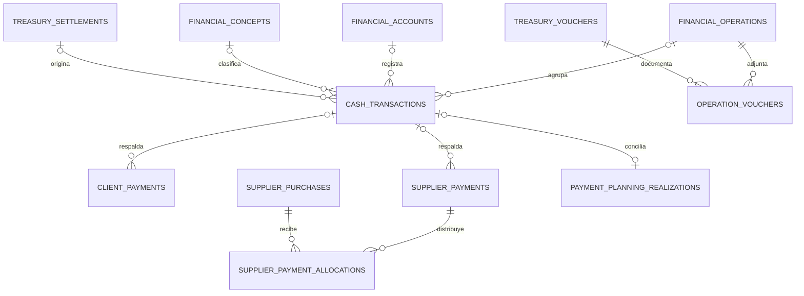

# Movimientos: auditoría y plan de formularios por operación

Fecha: 01/10/2026. Estado: 0/A1/A2 implementadas, v136/v137/v138 activadas en producción por autorización del usuario, sin despliegue. Las familias B/C y arqueo/apertura de D tienen código local y guardado habilitado mediante v138, ensayada y aplicada con copia previa y conservación de registros/saldos. Enlace automático con cambio de recorridos y reclasificación masiva pendientes. Ver [implementación](movimientos-implementacion-a.md) y [familias especializadas](movimientos-familias-especializadas.md).

## 1. Objetivo y decisión principal

Evolucionar el módulo existente de Movimientos para que el usuario elija qué operación realiza y reciba los campos adecuados. Reutilizar sus cuentas, conceptos, empleados, proveedores, pedidos, compras y movimientos; conservar Rendiciones como origen de los movimientos de recorridos y Planificación como origen o conciliador de ejecuciones planificadas.

La propuesta anterior de 12 familias sirve como clasificación funcional. No representa 12 módulos que haya que construir desde cero. El ER conceptual anterior queda sustituido, para implementar, por el modelo incremental de este documento.

Primera entrega utilizable: formularios de pago a proveedor, cobro de cliente, pago al personal, gasto/servicio, impuesto y transferencia, respaldados por registro, modificación y vinculación transaccionales. Los casos que necesitan un ciclo propio —fondos a rendir, divisas, financiación y arqueos— se entregan posteriormente con sus controles específicos.

## 2. Evidencia, base de trabajo y límites

- Revisión del árbol local de `D:\GitHub\zonoconstruccion`, rama `codex/optimizacion-rendimiento`, HEAD `f6f422e`, con numerosos cambios locales y archivos sin seguimiento. Las funcionalidades recientes están en ese árbol y no necesariamente en HEAD ni en la rama remota.
- Planilla de referencia: [MOVIMIENTOS CAJA 2026, Caja](https://docs.google.com/spreadsheets/d/12OEQtYGyjFLTgnr0I4b8oXnH2qymv6rrQuby9_-ssRY/edit?gid=1132485813#gid=1132485813). En esta conversación se leyeron 4.701 filas con fecha y detalle en Caja y los catálogos BdCols y BD.C; además, muestras de las reservas y otras hojas. El conteo es de filas, no de operaciones únicas.
- Fuentes técnicas: componentes, APIs, migraciones, helpers y pruebas locales. La presencia de una migración no acredita que esté aplicada en producción. No se verificó la interfaz desplegada ni se consultó el esquema de producción en esta auditoría.
- Se ejecutaron cuatro archivos de pruebas locales, sin conexión real a la base. Resultado: 15 casos reportados, 5 aprobados y 10 fallidos por la misma dependencia no simulada en el harness de interfaz; detalle en sección 11.
- Se entrega solamente este documento. No se cambiaron formularios, datos, migraciones ni reglas de negocio.

Antes de ejecutar, revisar el estado actualizado. Preservar cambios ajenos y archivos sin seguimiento. Si se trabaja en otra copia, trasladar explícitamente la base local pertinente y sus dependencias: comenzar desde el remoto sin esos cambios perdería Planificación, importación bancaria y mejoras recientes. Elegir el siguiente número de migración libre al implementar; ya existen números repetidos en el árbol.

## 3. Inventario: conservar, corregir y completar

| Capacidad | Estado observado | Decisión |
| --- | --- | --- |
| Listado de Movimientos | Filtros, búsqueda, fechas, cuentas, categorías, centro de costo, 50 filas por página, detalle, CSV, duplicación, edición y eliminación | Conservar la vista compacta y ampliar con tipo de operación y origen |
| Cuentas financieras | Efectivo, banco, virtual y tarjeta; ARS/USD; saldos y alta de cuentas | Reutilizar `financial_accounts`; la existencia de tipo tarjeta no acredita gestión de resúmenes |
| Conceptos | `financial_concepts`, importación XLSX, edición/activación, categoría, subcategoría, tipo y EFE; vínculo desde el movimiento | Extender el catálogo existente; evitar un catálogo paralelo |
| Alta manual | Formulario genérico con datos adicionales y lógica condicional por categoría | Extraer formularios por operación conservando controles compartidos |
| Accesos rápidos | General, eventuales, proveedor, gasto y adelanto; son presets del mismo modal | Convertirlos en entradas a formularios tipados, sin perder accesibilidad ni adaptación al ancho |
| Proveedores | Selección de proveedor; pago a una compra o anticipo; moneda/saldo comprobados en el cliente; cuenta corriente y punto de partida | Reutilizar y hacer atómico. Completar distribución entre varias compras y anticipo remanente |
| Cobros | Vínculo opcional a un pedido, aprobación de comprobantes y vinculación posterior | Reutilizar; validar en servidor y coordinar con pagos existentes, triggers y Rendiciones |
| Personal | Empleado opcional, sueldo base, eventuales y adelanto preseleccionados | Completar período/concepto e impedir que elegir persona sobrescriba un adelanto con el sueldo base |
| Transferencias | Dos filas en una misma inserción; cuentas distintas y misma moneda; grupo en `TRF-GROUP` dentro de notas | Conservar el formulario; agregar identidad estructurada, validación en base y corrección conjunta |
| Rendiciones | Gastos, efectivo esperado/contado, recuperación de faltante y generación de movimientos con `treasury_settlement_id`; reemplazo/duplicación y reapertura | Reutilizar el módulo. Conectar origen y edición; no crear otra rendición de recorridos |
| Planificación | Realización manual, realización con movimiento, alta ya realizada y conciliación de movimientos existentes; RPC con idempotencia | Reutilizar. El documento original de planificación está parcialmente superado por código posterior |
| Importación bancaria | Vista previa, rango, comparación con existentes, clave propia y RPC `import_bank_movements` | Conservar; agregar operación/origen sin romper claves ni repetir importaciones |
| Comprobantes de tesorería | Registro independiente, archivos privados, categorías y relaciones a proveedor/pedidos | Reutilizar almacenamiento y acceso; falta conexión comprobante–operación en el circuito examinado |
| Fondos a rendir generales | Conceptos de catálogo, pero no se encontró un ciclo dedicado entrega–gastos–devolución–saldo | Desarrollar después del núcleo transaccional; distinguirlos de recorridos |
| Divisas | Cuentas USD y campo `exchange_rate` en el modelo; transferencia actual rechaza monedas distintas | Crear operación específica con ambos importes/cuentas; no ampliar la transferencia por omisión |
| Préstamos, socios y bienes | Conceptos disponibles; no se encontró gestión específica de contratos/cuotas/bienes en el circuito revisado | Formularios y metadatos progresivos; no presentar el catálogo como un módulo completo |
| Arqueo de caja general | Hay arqueo por rendición y referencias de conciliación importada; no se encontró cierre general dedicado por cuenta | Reutilizar utilidades de conteo, agregar sesión de arqueo propia |
| EERR | API consulta una planilla EERR y otras fuentes; no calcula todo desde `cash_transactions` | Mantener integración actual; cambiar categorías en Movimientos no actualiza automáticamente ese informe |

Referencias principales (líneas orientativas de la revisión; volver a localizar símbolos si cambian):

- `src/app/admin/finanzas/page.tsx`: `reverseAndCleanLinks` (~856), `handleRegisterTx` (~1006), `handleRegisterTransfer` (~1255), `handleSaveLink` (~1355), `handleDeleteTx` (~1613), `openQuickMovement` (~1816), bloque de empleado (~2919).
- `src/components/finanzas/FinanceToolbar.tsx`, `FinancialConceptManager.tsx`, `SupplierAccounts.tsx`, `BankSheetImportModal.tsx`.
- `src/lib/financialConcepts.ts`, `financialAccountLabels.ts`, `supplierAccount.ts`, `treasuryTransactionTime.ts`, `treasurySettlements.ts`, `authenticatedRequest.ts`.
- `src/app/api/admin/finanzas-data/route.ts`, `rendiciones/route.ts`, `payment-planning/route.ts`, `supplier-accounts/route.ts`, `bank-sheet-import/route.ts`, `treasury-vouchers/route.ts`, `finanzas/eerr/route.ts`.
- Migraciones v44, v46, v50/v54, v94/v95, v104, v112–v121, v127, v132–v135 y sus dependencias.
- `docs/cuentas-corrientes-proveedores.md`: deuda al recibir mercadería, pagos/anticipos, corte histórico y conciliación. Conservar ese criterio.

## 4. Cambios necesarios en lo existente

### P0. Guardado y corrección completos

Actualmente el navegador escribe el movimiento, luego el pago y después el saldo del documento. Al editar o eliminar, `reverseAndCleanLinks` hace varias escrituras, omite comprobar algunos errores y captura excepciones sin propagarlas. Un fallo puede permitir que el flujo principal continúe con vínculos incompletos. Además, algunas validaciones de vinculación ocurren después de limpiar vínculos anteriores.

Trasladar creación, modificación, imputación y corrección a operaciones transaccionales de servidor/base. Validar todo antes de modificar, bloquear los documentos afectados y devolver un resultado único. Un fallo debe deshacer todos los efectos. El servidor debe recomputar saldos desde datos actuales; no aceptar como autoridad `paid_amount` o `pending_balance` enviados por el navegador.

En cobros, sustituir la ambigüedad de `Number(pending_balance) || total_amount`: cero es un saldo válido. Revisar la interacción con `sync_order_payment_to_ledger` y su definición realmente instalada antes de cambiar actualizaciones de pedidos. Ya hay pagos automáticos y pagos desglosados que podrían representar el mismo cobro.

### P0. Identidad de operación e integridad entre módulos

Una transferencia ya inserta sus dos filas juntas; no es correcto describir esa inserción como dos llamadas independientes. El problema es que el grupo existe solo en notas y la edición/eliminación general opera por fila. Introducir `operation_id` y corregir/anular el conjunto desde su operación.

Movimientos tampoco incorpora al tipo de interfaz ni a sus handlers generales controles específicos de `treasury_settlement_id` o de realizaciones de Planificación. Mostrar el origen y dirigir la corrección al flujo correspondiente. La FK de Planificación puede impedir una eliminación tardíamente, después de otras escrituras previas: comprobar dependencias antes de tocar datos y dentro de la misma transacción.

### P0. Autenticación coherente

En el código revisado, `finanzas-data/route.ts` usa un cliente con clave de servicio y no contiene una comprobación de usuario/rol en GET. No se encontró middleware/proxy en `src` que demuestre una protección equivalente. Esto es un hallazgo del código local, no una prueba de exposición del despliegue.

Agregar autenticación y permisos explícitos a las lecturas y nuevas escrituras, y adaptar sus clientes con `authenticatedRequest`. No reutilizar sin cambios un guard exclusivo de admin si Administración tiene acceso legítimo a Movimientos/Rendiciones. Documentar la matriz vigente de acciones por rol y comprobarla tanto en API como en RPC/RLS. La función SQL no debe confiar en un actor arbitrario recibido del cliente.

### P1. Separar operación, dirección y clasificación

Hoy `txCategory === 'Proveedores'`, `'Sueldos'` o `'Recaudación'` activa las relaciones. Por ello un pago categorizado como `Insumo de Producto` o `Proveedores (Deuda)` puede quedar fuera del circuito de proveedor. El formulario y los vínculos deben depender de `operation_type`, con categoría elegida dentro de las opciones compatibles.

Mantener `cash_transactions.type = ingreso/egreso` como dirección en una cuenta. `financial_concepts.movement_type` es una clasificación heredada del catálogo; no debe imponer por sí sola la dirección. Caso observado: Cambio Entregas contiene 205 entradas y 433 salidas en Caja aunque su catálogo indica Ingreso.

EFE y EERR no son sinónimos: la columna original se llama EFE y la UI actual la rotula «Clasificación de resultados». Mantener el dato y ajustar el rótulo a «Clasificación EFE»; documentar qué informe lo consume antes de cambiar su significado.

### P1. Personal, medios de pago y refresco

- Elegir un empleado actualmente asigna `base_salary` al importe y «Liquidación de Sueldo» al concepto. En eventuales/adelantos debe conservarse el subtipo y el importe ingresado; sugerir el sueldo base solo en la operación correspondiente y por acción explícita.
- Añadir período y referencia laboral. El módulo no debe calcular liquidaciones, cargas o descuentos legales automáticamente con solo `base_salary`.
- Hacer explícito el medio de pago compatible. Hoy se deduce por nombre/tipo de cuenta y puede caer en el primer medio de la lista. En la edición del movimiento no se actualiza `payment_method_id`, mientras el nuevo vínculo puede usar otro medio recalculado.
- `loadHelperLists` y `loadCostCenters` son funciones vacías; renovar pendientes/saldos afectados con una lectura real o respuestas del servidor tras guardar. No confiar en la lista de compras cargada inicialmente.
- Comprobar importes finitos, precisión, cuenta activa y moneda también en servidor; los controles HTML no bastan.

## 5. Modelo incremental recomendado

`cash_transactions` continúa siendo la fuente de los movimientos de dinero y de los saldos. Agregar una cabecera operativa y referencias, sin reemplazar las tablas por el ER genérico propuesto anteriormente.



Las cardinalidades opcionales contemplan datos heredados, como caja de vendedores con `register_id` y sin cuenta financiera. Para nuevas operaciones de Movimientos, la cuenta es obligatoria. La unicidad actual de conciliación en Planificación se conserva.

### Adiciones del núcleo

1. `financial_operations`: id, tipo estable, fecha efectiva, estado, versión, actor/fecha de registro, origen, detalle específico versionado y referencia de corrección cuando corresponda. Evitar un importe único de cabecera para operaciones con dos monedas; los importes definitivos viven en las líneas.
2. `cash_transactions.operation_id` nullable y una clave de línea única por operación. Conservar los campos y FK actuales. Las filas históricas siguen legibles con `operation_id = null`.
3. Registro de solicitudes idempotentes con `(actor, request_key)` único, acción, payload/hash y resultado; historial de eventos antes/después y motivo de corrección. Reutilizar el patrón de Planificación, con dominio propio.
4. Configuración tipada de formularios y validaciones en TypeScript. No construir un generador arbitrario de formularios ni un motor de reglas editable para esta primera entrega.
5. Relación explícita concepto–tipos de operación permitidos, para que un concepto pueda servir a más de una acción. Conservar los textos históricos como snapshot; editar el catálogo no reclasifica movimientos anteriores.
6. `operation_vouchers` para adjuntar comprobantes existentes con unicidad del par. Los archivos conservan permisos privados. Adjuntar un comprobante no crea dinero ni cancela una deuda.

Proveedores, clientes, empleados y fleteros conservan sus tablas e identificadores. No introducir ahora un maestro universal de terceros ni una tabla universal de documentos. Para un beneficiario externo sin maestro, guardar nombre/referencia explícitos hasta que exista una necesidad real de catálogo.

### Pagos e imputaciones de proveedores

Mantener `supplier_payments` como registro del pago total al proveedor. Añadir `supplier_payment_allocations(payment_id, purchase_id, amount)` para distribuirlo. Validar misma moneda/proveedor, sumas y saldo bajo bloqueo. El anticipo disponible es pago total menos imputaciones activas.

Compatibilidad: auditar primero las filas actuales y sus relaciones. Un pago legacy con `purchase_id` se convierte en una imputación de ese mismo pago, sin otro egreso. Si hay varias filas de pago para un mismo movimiento, revisar sumas y procedencia antes de consolidar. Conservar IDs usados por conciliación histórica o proporcionar un mapa verificable; nunca colapsar pagos solo por coincidencia de fecha e importe.

Actualizar `supplier_account_entries`, lecturas de Finanzas y cálculos de compras para contar el pago total una vez y usar imputaciones para el pendiente por documento. Retirar la escritura nueva de `supplier_payments.purchase_id` al activar la nueva distribución, manteniendo compatibilidad de lectura durante la transición. Ningún consumidor debe sumar simultáneamente ambas representaciones.

Para cobros, conservar `client_payments` y sus referencias a pedidos. En primera entrega, un pedido por cobro con validación robusta. La ampliación a varios pedidos debe distinguir cobro total y distribución, como en proveedores, después de comprobar triggers y cobros preexistentes. No crear una venta nueva al registrar un cobro.

## 6. Contrato de guardado y corrección

API autenticada propuesta: `src/app/api/admin/financial-operations/route.ts`. Helpers: `src/lib/financialOperations/{types,validation,server}.ts`. UI en `src/components/finanzas/operations/`.

- Entrada: acción, clave de solicitud, versión esperada cuando se modifica, tipo y datos del formulario. Actor tomado de la sesión verificada.
- Vista previa: el servidor deriva líneas, relaciones y efecto por cuenta; el cliente muestra el resultado antes de confirmar operaciones compuestas.
- Confirmación: RPC única valida y registra cabecera, líneas, imputaciones y evento. La base vuelve a validar importes/cuentas/documentos, aunque haya existido vista previa.
- Mismo reintento y payload devuelve el mismo resultado; misma clave con otros datos devuelve conflicto. Bloqueos con orden consistente; no duplicar una operación si la respuesta anterior se perdió.
- Edición: cambios de descripción/clasificación generan auditoría; importe, dirección, cuenta o imputaciones se actualizan juntos con control de versión. En transferencias, se editan ambas líneas. No permitir edición suelta que rompa la operación.
- Cancelación de nuevas operaciones: reversión trazable con líneas compensatorias vinculadas, una sola vez. Los saldos de caja incluyen original y compensación; no excluir además el original porque invertiría dos veces el efecto. En cuentas corrientes se revierten los pagos/imputaciones originales mediante estado explícito y recalculo; la compensación no es un nuevo cobro o pago comercial. Actualizar las vistas pertinentes en la misma entrega.
- Distinguir corrección de un error de carga de una devolución real de dinero: una devolución es otra operación de negocio relacionada.
- Operación originada en Rendiciones: mantener enlace y revisar/reemplazar mediante su flujo actual. Operación conciliada en Planificación: prohibir modificación financiera aislada; coordinar desconciliación/corrección mediante el dominio de origen. No ampliar silenciosamente el alcance de `reverse_realization`.
- Para histórico sin cabecera, conservar consulta y ofrecer una ruta segura de corrección que adopte la operación tras validar relaciones. No volver a habilitar borrados parciales por mantener un botón legacy.

Antes de restringir escrituras directas de `cash_transactions` en RLS, inventariar y adaptar productores: Movimientos, Rendiciones, Planificación, importación bancaria, caja/clientes de vendedores y cualquier RPC/trigger vigente. Hacerlo por etapas y no cortar caja de vendedores, que usa `register_id`.

## 7. Formularios y reglas por entrega

Campos compartidos: fecha, cuenta cuando hay dinero, moneda derivada de cuenta, importe, medio de pago, concepto, observaciones, centro de costo opcional y comprobantes opcionales. Autor obtenido de sesión. No pedir todas las dimensiones en todas las operaciones.

| Formulario | Datos propios | Efecto y reglas | Entrega |
| --- | --- | --- | --- |
| Pago a proveedor | Proveedor, documentos/importes o anticipo | Un egreso por medio/cuenta utilizado, un pago total e imputaciones; no crea mercadería ni deuda | A |
| Cobro de cliente | Pedido/cliente, importe pendiente | Un ingreso y vínculo a cobro; ofrecer conciliar si el cobro ya está registrado | A |
| Pago al personal | Empleado o beneficiario eventual identificado, período, sueldo/adelanto/eventual/acuerdo | Egreso; no calcular sueldo automáticamente ni borrar el subtipo elegido | A |
| Gasto o servicio | Beneficiario, concepto, categoría/subcategoría, referencia opcional de recorrido/vehículo | Egreso simple; si liquida un documento de proveedor, usar circuito de pago aunque su categoría sea gasto | A |
| Impuesto o carga | Organismo/concepto, período, cuota/referencia | Egreso; no calcular obligaciones fiscales | A |
| Transferencia interna | Origen, destino, importe y motivo | Dos líneas opuestas, misma moneda, cuentas distintas; neto conjunto cero | A |
| Fondo a rendir | Custodio, finalidad, entrega, gastos, devoluciones y reintegros | Ciclo con saldo pendiente; rendir comprobantes no implica que volvió efectivo | B |
| Cambio de moneda | Dos cuentas, dos importes positivos, cotización expresada con unidad y comisión | Dos monedas; comisión separada cuando la hay; no igualar importes nominales | C |
| Préstamo/financiación | Contraparte, referencia, recibir/devolver, capital e intereses/cargos | Separar capital/costo; contrato/cuotas enlazados si se necesita seguimiento | C |
| Aporte/retiro de socio | Socio, acción y motivo | Dirección según acción; no deducir que un gasto personal es sueldo | C |
| Compra/venta de bien | Bien/referencia, contraparte y documento | Evitar pagar dos veces si ya existe compra/documento; gestión de activos/depreciación fuera de alcance | C |
| Apertura/arqueo/ajuste | Cuenta, fecha de corte, conteo, saldo esperado, diferencia y motivo | Conteo sin movimiento hasta confirmar ajuste; apertura no duplica saldos históricos | D |

Los campos de período, referencia y subtipo deben persistirse como datos estructurados. Para la entrega A puede usarse detalle JSON tipado/versionado de la operación, con validación de servidor; relaciones e importes monetarios críticos deben tener FK/columnas y restricciones SQL.

### Fondos a rendir (B)

Crear cabecera y eventos para un fondo/custodio con importes entregados, rendidos, devueltos y reintegrados. Ejemplo de aceptación: entrega 30.000, gastos justificados 24.000 y devolución 6.000: saldo cero; caja principal termina 24.000 abajo, gastos 24.000, ninguna venta.

Diseño propuesto: cuenta de custodia explícita, separada de efectivo disponible en caja. Entrega = transferencia a custodia; gasto rendido = egreso de custodia; devolución = transferencia a caja; exceso pagado por la persona = obligación de reintegro identificada. Los listados deben distinguir disponibilidad física y dinero bajo custodia. Si no se adopta cuenta de custodia, diseñar una subcuenta operativa equivalente antes de construir; no simular el gasto como retorno de dinero a caja.

El cambio de recorridos debe seguir enlazado a Rendiciones. No generar nuevamente su entrega o devolución si ya está registrada. Reserva en Planificación y dinero físicamente separado son conceptos distintos; solo el segundo produce transferencia real entre cuentas identificadas.

### Arqueos (D)

El arqueo de Rendiciones ya existe y se conserva. Para cuenta general, guardar conteo, fecha/hora de corte, saldo esperado reproducible y versión de movimientos observada. Un movimiento retroactivo requiere recalcular/revisar el arqueo; confirmar una diferencia no modifica silenciosamente la apertura. Saldo inicial de una cuenta existente requiere evidencia de corte y exclusión de doble carga.

## 8. Integraciones que condicionan la implementación

### Rendiciones

`buildTreasuryMovementRows` genera un ingreso por efectivo contado, otro por gastos, egresos por esos gastos y eventualmente recuperación de faltante. Por ejemplo, contado 100 y gastos 20 generan +100 +20 -20 = +100 neto. El par adicional no demuestra por sí solo un duplicado: representa el desglose bruto actual.

Conservar esa equivalencia y sus casos de prueba al tipar las líneas. Auditar aparte la inclusión de cambio y recuperaciones al clasificar recaudación comercial; no suponer que toda entrada del lote es venta. El generador actual permite reemplazar o duplicar expresamente; evitar que un reintento se interprete como duplicación autorizada. Mantener la operación de duplicar explícita si sigue siendo necesaria en el flujo vigente, con auditoría y advertencia de efecto.

### Planificación

Ya hay `payment_planning_realize_with_movement`, `payment_planning_create_realized` y `payment_planning_reconcile`. Sus claves de solicitud, eventos y referencia `cash_transaction_id` deben sobrevivir al nuevo núcleo. Registrar el pago desde Planificación debería utilizar el mismo contrato transaccional para completar proveedor/empleado/documentos cuando corresponda; actualmente generar una fila de caja no implica imputarla a un proveedor.

Conciliar un movimiento existente no genera otro. Revertir una realización declarada manualmente no equivale a devolver dinero. Para nuevas operaciones compuestas mantener la conciliación actual por línea elegible; una transferencia interna no debe ofrecerse como pago comercial por la mera coincidencia de dirección/importe.

### Importaciones y conceptos

Conservar `bank_import_key`, `is_imported`, fechas y procedencia. La clasificación de históricos puede sugerirse, pero cambios en importes, signos, cuentas o emparejamientos requieren evidencia. Normalizar diferencias de mayúsculas/acentos para buscar; no fusionar automáticamente conceptos con significado diferente.

Para transferencias legacy, enlazar por `TRF-GROUP` exacto solo si hay un par consistente: dos filas, signos opuestos, mismo importe/moneda y cuentas distintas. Casos con una o más de dos filas quedan para revisión. Importar metadatos de operación debe producir delta monetario cero por cuenta y moneda.

## 9. Orden de ejecución y criterios de salida

### 0. Fijar la base y reparar la validación existente

1. Releer este plan, cambios locales y documentación actual. Confirmar migraciones aplicadas mediante inspección de solo lectura del entorno elegido.
2. Inventariar funciones, triggers, políticas y consumidores vigentes; registrar esquema/versión usados. No aplicar migraciones antiguas indiscriminadamente.
3. Corregir el harness de pruebas que no resuelve `BankSheetImportModal`, ejecutar baseline y distinguir errores de entorno de fallos reales.
4. Crear fixtures representativos: cobro con pagos automáticos, proveedor con anticipo, transferencia, rendición, movimiento conciliado, importación y caja de vendedor.

Salida: base reproducible y matriz de productores/consumidores/permisos. No usar la ausencia de errores de TypeScript como prueba de integridad monetaria.

### A1. Núcleo seguro sobre funcionalidades actuales

Implementar cabecera/solicitudes/eventos, API autenticada, RPC de altas/correcciones, protección de grupos/orígenes y vínculo de transferencias. Adaptar proveedores/cobros y vistas de saldos, coordinando triggers. Resolver errores de permisos, medio de pago y listas pendientes en la misma entrega.

Salida: guardado indivisible y reintentos seguros; edición no pierde imputaciones; transferencias no se rompen; importes y saldos previos siguen iguales salvo operaciones de prueba previstas.

### A2. Formularios cotidianos

Extraer el modal monolítico en componentes por operación, con controles compartidos. Habilitar proveedor, cobro, personal, gastos, impuestos y transferencia. Agregar distribución de pagos a proveedores, saldo de anticipo, período laboral/tributario, documentos adjuntos y origen visible. Mantener el acceso a Rendiciones y Planificación desde los movimientos relacionados.

Salida: los seis formularios permiten registrar casos reales sin editar categorías para habilitar relaciones. Un único listado muestra resultados y permite abrir el origen. Mantener la entrada genérica para excepciones autorizadas con validación y trazabilidad equivalentes.

### B. Fondos a rendir

Implementar saldo por custodio, gastos justificados, devolución, reintegro y cierre. Validar el ejemplo 30.000/24.000/6.000. Conectar cambio de recorridos mediante referencias verificadas, conservando la generación existente.

### C. Operaciones especializadas

Implementar divisas, socios, financiación y bienes en ese orden o según uso observado. Completar campos específicos y relaciones necesarias. El pago de tarjeta cancela una obligación: comprobar que compras/cargos ya registrados no se conviertan otra vez en gasto. Operaciones sin fuente de deuda definida permanecen pendientes de clasificación, sin inventar saldos iniciales.

### D. Arqueo, aperturas e histórico

Agregar arqueo general y ajustes trazables. Ejecutar reclasificación histórica en vista previa con métricas antes/después y mapa de IDs. Migrar solo casos verificables; conservar casos ambiguos accesibles y señalados. Cambiar informes EERR/EFE es una entrega aparte si se decide que su fuente pase a ser Movimientos.

Cada entrega incluye implementación, pruebas y revisión de UI. Publicación y modificaciones en producción dependen de la instrucción vigente cuando se ejecute; este documento no solicita desplegar todo el árbol actual.

## 10. Pruebas de aceptación obligatorias

| Caso | Resultado esperado |
| --- | --- |
| Pago 100, documento pendiente 80 | Caja -100, pago 100, imputación 80, anticipo 20; cuenta corriente acredita 100 una sola vez |
| Pago 100 a dos documentos 60/40 | Una salida, un pago total, dos imputaciones; ambos pendientes correctos |
| Dos sesiones intentan pagar el mismo saldo | La segunda revalida bajo bloqueo; no hay exceso ni saldo perdido |
| Error después de insertar caja pero antes de imputar | Rollback completo |
| Respuesta perdida y reintento con la misma clave | Mismos IDs, ningún movimiento adicional |
| Edición de un pago vinculado | Imputaciones y saldos anteriores/nuevos consistentes; el fallo conserva el estado anterior |
| Cobro de pedido con saldo cero | No toma el total como pendiente ni crea otro pago por error |
| Pedido con pagos automáticos/desglosados | Vínculo a caja conserva el total cobrado; trigger no suma otra vez el cobro |
| Transferencia 500 de A a B | A -500, B +500, conjunto cero; edición/corrección actúa sobre ambas |
| Transferencia a misma cuenta o distinta moneda | Rechazada por servidor/base |
| Cambio 700.000 ARS por 500 USD | ARS -700.000, USD +500, tasa 1.400 ARS/USD; comisión independiente |
| Elegir empleado en adelanto/eventual | No cambia el subtipo ni reemplaza un importe cargado por sueldo base |
| Proveedor con categoría Insumo de Producto | Conserva proveedor e imputación; categoría no decide si hay vínculo |
| Fondo 30.000, gasto 24.000, devolución 6.000 | Pendiente cero, caja principal -24.000, sin recaudación ficticia |
| Rendición contado 100, gastos 20 | Neto +100 bajo el generador actual; enlace de origen y desglose conservados |
| Conciliación de movimiento existente | Planificación se vincula sin nueva caja |
| Movimiento conciliado editado/eliminado | Acción coordinada o rechazo íntegro antes de escrituras |
| Importación bancaria repetida | Ninguna segunda fila por la misma clave |
| Reclasificación/adopción histórica | Misma cantidad de movimientos monetarios e idénticos saldos por cuenta/moneda |
| Usuario sin sesión o rol requerido | Lecturas y escrituras rechazadas sin exponer datos |
| Administración con rendición propia del circuito permitido | Conserva su acceso autorizado, sin adquirir permisos generales de admin |
| Caja de vendedores | Sigue funcionando con su registro abierto y permisos existentes |
| Arqueo sin confirmar ajuste | No modifica saldo; repetir confirmación no duplica diferencia |
| Formulario en pantalla angosta | Campos y acciones accesibles; conserva foco, filtros y contexto al volver |

Usar fixtures y base de pruebas para fallos/concurrencia. No ejecutar scripts `apply-*`, `import-*` ni pruebas de integración que creen datos reales sin revisar su destino y alcance.

## 11. Resultado de validación de esta auditoría

Comando ejecutado:

```powershell
node --test tests/finance-workspace.test.cjs tests/financial-concepts.test.cjs tests/finance-opening-balance.test.cjs tests/supplier-account.test.cjs
```

Resultado: 15 casos reportados; 5 pasan y 10 fallan. Los 10 fallos de `finance-workspace.test.cjs` ocurren al cargar `@/components/finanzas/BankSheetImportModal` desde `tests/helpers/finance-workspace.cjs`, cuyo mapa de módulos no incluye el componente importado recientemente. El componente sí existe en el repositorio. Esto impide ejecutar esas aserciones; no demuestra que los diez comportamientos de producto estén rotos ni acredita que funcionen.

Pasaron el parser de conceptos, el cálculo de cuenta corriente de proveedor, dos controles del saldo inicial y el cálculo de distribución de botones. No se realizó build ni prueba de producción, porque esta entrega es una auditoría y un plan sin cambios de aplicación.

Al ejecutar: reparar el harness, correr estas pruebas y las pertinentes de Planificación, Rendiciones, conciliación e importación bancaria después de inspeccionar si son unitarias o usan base real. Añadir pruebas de comportamiento de los casos monetarios de la sección 10, typecheck/lint de lo cambiado y build según la base elegida. No sustituir pruebas de transacciones por búsquedas de texto en código.

## 12. Decisiones pendientes acotadas

No impiden iniciar las entregas 0 y A. Confirmar al llegar al circuito correspondiente:

- Si las reservas de sueldos/proveedores son cajas físicas diferenciadas o asignaciones de disponibilidad dentro de una misma caja. En la planilla, ambas muestras usaban `Caja.EfectivoRva1`; no crear cuentas distintas ni fusionar saldos solo por el nombre de la pestaña.
- Qué representan «Cambio Entregas», ciertos «Rendido / Ingreso» y el ingreso bajo «Compra de dólares» del 16/04. Los nombres no demuestran un retorno efectivo ni una venta de moneda.
- Si los gastos personales/extracciones de Carolina corresponden a socio, remuneración u otro acuerdo. Conservar clasificación histórica hasta verificarla.
- Alcance deseado de contratos/cuotas de préstamos y resúmenes de tarjeta. El registro del movimiento no necesita convertirse automáticamente en un módulo completo de deuda.
- Si EFE debe alimentar un informe nuevo y cuándo EERR dejaría de depender de planillas. No prometer ese cambio como efecto de los formularios.

Para conceptos ambiguos, mantener clasificación pendiente y datos originales. Las preguntas futuras deben referirse a ejemplos concretos, no detener los formularios cotidianos ya definidos.

## 13. Instrucción de continuación para el modelo ejecutor

> Implementá el plan de `docs/plan-movimientos-formularios.md` empezando por las entregas 0, A1 y A2. Revalidá primero el árbol local y el esquema del entorno de trabajo. Conservá las funcionalidades recientes de Rendiciones, Planificación, cuentas corrientes e importación bancaria; el HEAD por sí solo no las contiene todas. Reutilizá `cash_transactions` y catálogos existentes. Priorizá integridad transaccional, identidad de operación, permisos, reintentos y compatibilidad antes de agregar formularios. Registrá diferencias respecto de esta auditoría y probá los casos de aceptación. Las entregas B, C y D tienen dependencias y decisiones específicas: no las declares completas mediante presets de un formulario genérico. Este pedido inicial fue de planificación; la instrucción que acompañe esta continuación define el alcance de implementación y despliegue.
