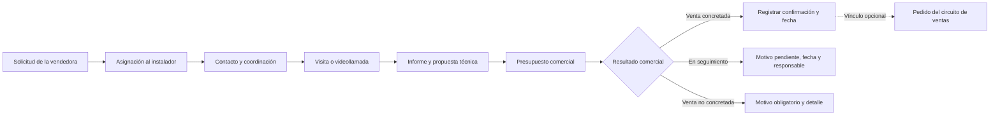

# Plan del módulo de visitas e instalaciones

Fecha: 06/10/2026. Estado: primera versión implementada por instrucción «ejecutar plan». Migración v147 activada en la base del ERP. Aplicación compilada y disponible en la vista local; publicación web pendiente.

## 1. Objetivo y alcance

Incorporar al ERP un módulo «Seguimiento de visitas» cuyo objetivo principal, confirmado por el usuario, sea conocer qué visitas se realizaron, qué se habló y presupuestó, si se concretó la venta y, cuando no se concretó, por qué. Vendedoras e instalador registran la información en el mismo caso. Cada caso debe mostrar qué ocurrió, el resultado comercial y quién debe actuar y cuándo.

Primera aplicación: instalaciones BIOFORT. Preparar la estructura para más instaladores y servicios, manteniendo un formulario inicial adaptado a biodigestores.

Unidad de trabajo: un expediente por cliente y obra/dirección, con varias visitas o videollamadas si hacen falta. Un mismo cliente puede tener distintas obras. El expediente conserva una vendedora responsable, un instalador asignado, historial y enlaces a uno o varios pedidos.

Independencia confirmada por el usuario: este módulo es un circuito paralelo a Pedidos. Tiene código, estados, agenda, presupuestos e historial propios. Puede crearse, gestionarse y cerrarse sin ningún pedido asociado. Los pedidos son referencias opcionales y pueden vincularse después, incluso si existían antes de solicitar la visita. Vincular un pedido no cambia automáticamente el estado del expediente, ni un cambio o cancelación del pedido cancela la visita o borra su historial. Se comparte información de referencia mediante acciones explícitas, sin hacer depender un circuito del otro.

Preferencias de alcance y acceso:

- Visibilidad entre vendedoras, confirmada por el usuario: todas ven las visitas, conservando responsable comercial y autor de cada modificación. Todas pueden registrar seguimiento y cubrir a una compañera; la reasignación de responsable se registra explícitamente y no ocurre por editar o comentar.
- Prioridad confirmada: seguimiento de las visitas realizadas y su conversión a venta, con motivo obligatorio cuando no se concreta. La propuesta de primera versión se concentra en este circuito; la gestión de ejecución de instalaciones queda como ampliación posterior.

La agenda, el relevamiento y la cotización sirven a ese seguimiento. La ejecución de obras y la integración contable no son requisitos para habilitar la primera versión.

## 2. Evidencia del export

Fuente: `D:\Descargas\Telegram Desktop\ChatExport_2026-10-06\result.json`, grupo «Instalaciones BIOFORT», con 1.870 mensajes entre el 15/05/2026 y el 06/10/2026. Se revisaron los textos y contextos operativos relevantes. El export incluye 359 mensajes de voz y 42 mensajes con foto: su contenido no fue transcrito ni analizado visualmente para este plan. Las notas técnicas y tarifas podrían ampliarse después de revisar ese material.

| Situación observada | Evidencia, fecha e ID de mensaje | Consecuencia para el módulo |
| --- | --- | --- |
| El instalador debe definir metraje y materiales antes de ir a instalar | 30/05, 937638 | Informe técnico y adicionales separados de la gestión comercial |
| El cliente tiene visita prevista pero no fue contactado para indicar horario | 02/06, 938346; 27–28/07, 953753 y 953904 | Registro explícito de contacto y de horario comunicado al cliente |
| Se confunden presupuestos de distintos clientes entre audios y conversaciones | 18/06, 943805 y 943828 | Toda nota y cotización pertenece a una ficha identificada |
| Después de la visita el instalador comunica importe y la vendedora debe cerrar forma de pago | 24/06, 944879 | Separar propuesta técnica, presupuesto comercial y aceptación |
| También se coordinan videollamadas | 04–06/07, 947071, 947385 y 947391 | Modalidad presencial o videollamada |
| La visita puede revisar una instalación existente que funciona mal | 23/07, 952189 | Motivo de diagnóstico/revisión y vínculo opcional con postventa |
| El crédito de la visita puede corresponder a alguien distinto del cliente de una instalación | 29/07, 954549; 04/08, 956694 | Identificar pagador, beneficiario y aplicación del crédito |
| Se asignan dos visitas la misma mañana a unos 200 km de distancia | 19/08, 962677–962680 | Agenda conjunta y aviso de incompatibilidades de horario/zona |
| Los adicionales incluyen metraje, materiales y trabajos específicos | 19/09, 976605; 23/09, 978040; 01/10, 981591 | Detalle por concepto, cantidad e importe; no solo un total libre |
| Una visita puede terminar en varios números de pedido | 06/10, 982540 | Relación con varios pedidos sin duplicar el caso |

Los importes del chat son antecedentes históricos, no tarifas vigentes validadas. Por ejemplo, aparecen visitas de $50.000 y distintas cotizaciones de adicionales. No convertirlos en precios fijos del sistema.

## 3. Personas y responsabilidades

| Perfil | Acciones propuestas |
| --- | --- |
| Vendedora | Crear solicitudes, completar información comercial, proponer disponibilidad, consultar agenda, registrar conversaciones, preparar/enviar presupuesto comercial, hacer seguimiento y vincular pedidos |
| Instalador | Ver sus casos asignados y agenda, aceptar la asignación, registrar intentos de contacto, coordinar fecha/hora, informar resultado técnico, materiales y adicionales, registrar qué importe comunicó y actualizar ejecución si se incluye |
| Administrador | Ver todos los casos, asignar/reasignar, configurar servicios y tarifas, resolver excepciones, autorizar traslados de crédito y revisar indicadores |

El instalador tendrá su cuenta con rol específico `instalador`. Sus permisos abarcan los datos necesarios de sus casos: contacto, obra, productos relacionados y presupuesto autorizado. El acceso al resto del ERP debe verificarse en servidor y base, además de la navegación.

La vendedora conserva el cierre comercial y los pedidos. El instalador puede registrar una cotización técnica o un precio que ya comunicó, sin que ese registro implique validación comercial o cobro confirmado. Toda modificación indica autor y fecha.

## 4. Circuito y estados

Flujo habitual:

Permitir asesoramiento remoto y presupuesto sin visita presencial, registrando el origen del diagnóstico. También permitir vincular una solicitud con un pedido ya existente. La aceptación y el cierre del caso se registran en el módulo aun cuando no haya pedido. Los estados de entrega, pago o cancelación del pedido se muestran como contexto cuando corresponda, sin reemplazar los estados de visitas e instalaciones.

Evitar un único estado que mezcle contacto, visita, presupuesto y dinero. Cada ficha tendrá estas dimensiones:

| Dimensión | Estados o datos |
| --- | --- |
| Contacto | Sin intentar, intento sin respuesta, contactado; historial de intentos, fecha, interlocutor y canal |
| Cada visita | Por coordinar, propuesta, confirmada, realizada, no realizada o cancelada |
| Presupuesto | Sin preparar, propuesta técnica, borrador comercial, enviado, en seguimiento, aceptado, rechazado, vencido o reemplazado |
| Cobro de visita | No corresponde, pendiente, parcial, informado o verificado; importe y comprobantes |
| Instalación, si se incluye | Por coordinar, programada, en ejecución, finalizada o cancelada |
| Expediente | Abierto, ganado, perdido o cancelado; ganado no significa instalación finalizada |

### Resultado comercial obligatorio después de la visita

Toda visita realizada queda asociada a un resultado comercial visible. La realización de la visita no implica aceptación del presupuesto ni venta concretada. El resultado actual se administra en el expediente para no contar varias ventas por visitas repetidas de una misma obra; el historial permite conocer qué resultado se registró después de cada visita.

| Resultado | Información requerida |
| --- | --- |
| En seguimiento | Motivo por el que aún no se concretó, última gestión, próxima acción, responsable y fecha de seguimiento |
| Venta concretada | Fecha de confirmación, quién la registró, qué aceptó el cliente y medio/evidencia de confirmación; importe si está definido y pedido opcional |
| Venta no concretada | Motivo obligatorio, explicación del caso, fecha y autor del cierre |

No permitir cerrar una oportunidad como venta no concretada sin motivo. Tampoco dejar una visita realizada indefinidamente sin resultado: si todavía no se conoce la decisión, queda en seguimiento con la explicación y próxima gestión correspondiente. Vencer una fecha, no recibir respuesta o vencer un presupuesto no cierra automáticamente la oportunidad.

Catálogo inicial sugerido de motivos de no concreción: precio/presupuesto, forma de pago o financiación, eligió otro proveedor, decidió hacerlo por su cuenta, condiciones técnicas no viables, obra postergada/cancelada, no respondió tras seguimiento y otro. «Otro» requiere explicación específica. Registrar como motivo confirmado lo que manifestó el cliente; si solo se observa falta de respuesta, registrar esa situación y los intentos, sin inferir precio u otra causa.

Para casos en seguimiento, usar razones como pendiente de enviar presupuesto, esperando respuesta, evaluando presupuesto, esperando financiación o esperando avance de obra. Si se posterga con posibilidad de venta futura, conservar el seguimiento y una fecha; si el cliente desiste, registrar venta no concretada con motivo.

La vendedora responsable mantiene el seguimiento comercial y confirma el cierre. El instalador registra el resultado de la visita, qué habló, qué cotizó y la respuesta del cliente, y puede informar una aceptación o rechazo para que quede disponible al equipo. Las demás vendedoras pueden colaborar según los permisos compartidos. Reabrir un caso o concretar una venta después de un cierre conserva el motivo y el historial anteriores.

«Confirmada» exige fecha y franja horaria, acuerdo del instalador y registro de conformidad del cliente. Una fecha propuesta por la vendedora no confirma la disponibilidad del técnico.

Reprogramar conserva fecha anterior, motivo y autor; deja pendiente la nueva confirmación. Si cambia una cita confirmada, registrar cuándo se informó al cliente. «No realizada» exige motivo: no respondió, no estaba, problema de acceso, clima u otro.

La ficha siempre muestra «Próxima acción», responsable y vencimiento. Ejemplos: «Juan debe contactar», «Jazmín debe enviar presupuesto» o «Esperando respuesta del cliente; retomar el viernes».

## 5. Información a registrar

### Alta rápida de la vendedora

Obligatorios al solicitar: nombre del cliente, teléfono, localidad, motivo, kit de interés y vendedora responsable. Instalador asignado si ya se conoce; permitir solicitudes sin asignar.

Datos adicionales progresivos:

- Cliente existente o interesado nuevo, sin obligar a crear un pedido.
- Dirección real de la obra, barrio/lote, referencias y enlace a Maps. No tomar automáticamente «Depósito» como dirección de instalación.
- Persona que atiende la visita, contacto alternativo/albañil/administrador y horarios para comunicarse.
- Modalidad, días y franjas disponibles, restricciones de acceso y fecha deseada.
- Kit de interés seleccionado del catálogo de kits existente; además, equipo propio o comprado en Zono, modelo/capacidad y pedidos o presupuestos previos si corresponde.
- Qué informó la vendedora sobre precio de visita, alcance base, exclusiones y adicionales; registrar aceptación del costo por el cliente.
- Fotos, documentos y observaciones relevantes.

Dirección y franja horaria deben estar completas antes de confirmar una visita presencial. Una videollamada requiere hora o franja acordada y contacto disponible.

### Kit de interés y kit finalmente seleccionado

Requisito confirmado por el usuario: la vendedora debe cargar cuál es el kit de interés. Luego el instalador puede confirmar ese mismo kit, cambiar la selección o definir cuál es el kit finalmente seleccionado después de hablar con el cliente o realizar la visita.

Conservar dos datos distintos en la ficha:

- **Kit de interés inicial:** el seleccionado al cargar la solicitud, con nombre, modelo/capacidad y referencia al kit del catálogo. Conservarlo como antecedente aunque después se elija otro; las correcciones de carga quedan auditadas.
- **Kit finalmente seleccionado:** opcional mientras se evalúa el caso. El instalador puede elegir el mismo u otro kit y registrar fecha, autor y observación/motivo si cambia respecto del interés inicial. Mostrar «Sin definir» hasta que se confirme una selección, sin copiar automáticamente el inicial como si hubiera sido confirmado.

Usar un selector con búsqueda y datos identificatorios del kit, reutilizando el catálogo existente. Conservar una copia del nombre y configuración seleccionados para que cambios posteriores del catálogo no reescriban la historia de la visita. Los materiales y trabajos adicionales se registran aparte del kit.

La selección final del instalador no marca automáticamente una venta concretada: sigue siendo necesaria la confirmación comercial. Al registrar la venta, identificar el kit aceptado por el cliente; puede ser el final definido por el instalador o el inicial confirmado durante el cierre, sin obligar al técnico a cambiarlo ni a intervenir nuevamente. Si el cliente acepta uno distinto, conservar ese cambio y su confirmación en el historial.

El presupuesto debe indicar el kit que efectivamente se cotizó. Cambiar el kit seleccionado no modifica retroactivamente importes, versiones enviadas ni presupuestos aceptados; cualquier nueva cotización conserva la versión anterior.

### Acciones simples del instalador

Botones desde el celular: «Registrar contacto», «Coordinar visita», «Registrar resultado» y «Cargar cotización»; actualización de instalación si se incluye.

Cada contacto guarda canal, interlocutor, fecha, resultado, resumen de lo conversado y próximo paso. Abrir WhatsApp o el marcador del teléfono no registra automáticamente una comunicación exitosa.

El relevamiento técnico permite registrar:

- Tipo y cantidad de viviendas/personas, conexiones previstas y equipo existente/recomendado.
- Condiciones observadas de suelo, napa, pendientes, acceso, agua y electricidad.
- Ubicación propuesta del equipo, distancia a conexiones y metros de campo de infiltración.
- Trabajos incluidos, adicionales, cantidades de materiales, fotos y croquis.
- Viabilidad: viable, viable con condiciones, requiere información o no viable; explicación y condiciones pendientes.

No exigir toda la ficha técnica para cada contacto. Para cerrar una visita como realizada, pedir un resumen de resultado y la próxima acción, o motivo de cierre del caso. Un diagnóstico telefónico no debe aparecer como inspección presencial.

### Cotización y aceptación

Registrar por separado kit/equipo, mano de obra, adicionales, materiales extra, traslado y descuentos. Cada concepto contiene descripción, cantidad, unidad, precio y subtotal; incluir alcance, exclusiones, vigencia y condiciones de pago.

Permitir que el técnico declare «comuniqué este importe al cliente» con fecha y canal. La vendedora revisa y prepara la versión comercial para enviar. El sistema conserva versiones y el detalle aceptado; cambios posteriores crean una nueva versión y requieren nueva aceptación de lo modificado.

La aceptación guarda quién la informó, cuándo y por qué medio, independientemente de la existencia de un pedido. Los importes, señas y saldos informados de la visita o servicio pueden registrarse operativamente en el expediente. Si existe un cobro registrado en un pedido vinculado, se referencia para evitar duplicarlo. Un presupuesto aceptado sin seña no equivale a un pago registrado. La integración contable se define por separado y no condiciona el uso del módulo.

## 6. Cobro y crédito de la visita

Registrar tarifa pactada, recargo si corresponde, pagos parciales, quién recibió el dinero, fecha, medio y comprobante. Separar «el instalador informa que cobró» de «cobro verificado».

Cuando la visita se descuenta de la instalación, generar una referencia de crédito con pagador, beneficiario e importe disponible, aunque todavía no exista un pedido. Registrar su aplicación en el presupuesto del expediente y, si corresponde más adelante, en el pedido vinculado, conservando la misma referencia para no aplicarlo dos veces. Para la primera versión puede ser un único crédito por visita; múltiples pagos y aplicación parcial deben preservar el saldo.

Reglas:

- Nunca aplicar más que lo efectivamente pagado y verificado.
- No duplicar el descuento entre presupuestos, pedidos divididos o distintas obras.
- Un traslado de beneficiario requiere autorización administrativa y motivo.
- Aplicar el crédito en la versión comercial reduce el total; no volver a contarlo como pago o anticipo del pedido.
- Si ya se registró como anticipo en el circuito actual, usar esa referencia y evitar un segundo descuento.
- Anular o revertir una aplicación conserva historial y restituye el saldo correspondiente.

Antes de implementar el circuito contable, confirmar cómo se registran hoy las visitas cobradas por Juan y quién valida esos cobros. Hasta definirlo, el módulo solo propone el registro operativo y la referencia; no genera movimientos contables automáticamente.

## 7. Pantallas

### Bandeja de vendedoras y administración

Tabla compacta centrada en seguimiento: código, cliente/localidad, fecha de visita realizada o próxima cita, kit, vendedora, instalador, presupuesto/importe, resultado comercial, motivo si no se concretó y próxima acción. La columna Kit muestra el seleccionado finalmente o, mientras no esté definido, el de interés identificado como tal; el detalle permite comparar ambos. Filtros por kit, responsable, localidad, modalidad, fecha de visita y resultado; búsqueda por nombre, teléfono, dirección o pedido. Contacto y última actualización se muestran en el detalle o expansión de la fila.

Vistas principales: Visitas realizadas, En seguimiento, Ventas concretadas y Ventas no concretadas. Vistas operativas complementarias: Sin asignar, Sin contactar, A coordinar, Hoy, Falta informe y Falta presupuesto. Destacar seguimientos vencidos y mostrar el motivo de no concreción sin tener que abrir cada ficha.

Resumen inicial: visitas realizadas, oportunidades en seguimiento, ventas concretadas y ventas no concretadas por motivo. Mostrar claramente que puede haber varias visitas por oportunidad; la conversión se calcula por oportunidades visitadas, con las que siguen pendientes identificadas, evitando contar dos veces una venta por revisitas. Filtrar por período de visita, vendedora e instalador.

### Agenda

Vista diaria/semanal compartida y filtro por instalador. Mostrar visitas presenciales, videollamadas y, si se incluye, instalaciones. Advertir solapamientos y mostrar localidades antes de confirmar.

La primera versión no calcula recorridos ni tiempos de viaje. El caso de los 200 km justifica agrupar por zona y dejar margen para traslados; la optimización automática se evalúa después.

### Ficha

Encabezado con cliente, obra, responsables, próxima acción y botones según el perfil. Secciones: contacto/agenda, informe técnico, presupuestos, cobro de visita y pedidos relacionados. Historial cronológico con cambios y conversaciones, adjuntos junto al evento correspondiente.

### Vista del instalador en celular

Entrada «Mi agenda» con Hoy, Próximas y Pendientes. Mostrar nombre, localidad, hora/franja, dirección y accesos para llamar, WhatsApp y Maps. Formularios cortos con campos ampliables; conservar lo escrito ante errores y advertir sobre cambios sin guardar.

## 8. Integración con el proyecto

El proyecto ya utiliza Next.js y Supabase. Existen clientes, pedidos, presupuestos guardados (`sales_quotes`), seguimiento de presupuestos y usuarios con múltiples roles. La navegación y validación actual enumeran seis roles y todavía no incluyen instalador.

Propuesta técnica sujeta al diseño final:

- Ruta compartida `/visitas`, accesible con los permisos correspondientes, más la vista de agenda del instalador dentro del mismo módulo.
- Entidades específicas para expedientes, citas, contactos, informes, presupuestos y sus versiones, adjuntos y eventos. Relación opcional de varios pedidos por expediente; ningún pedido obligatorio ni eliminación en cascada del expediente por borrar un pedido.
- Guardar referencias y copias históricas del kit de interés inicial y del finalmente seleccionado, con autor/fecha/motivo de selección y cambios. El kit de interés es obligatorio al crear la solicitud; el final puede quedar pendiente. Validar que la selección corresponda a un kit permitido del catálogo y registrar el kit de cada versión de presupuesto.
- Mantener presupuestos propios del módulo, admitiendo servicios y mano de obra sin productos ni pedidos. Reutilizar componentes de cálculo, catálogo o presentación de los presupuestos comerciales actuales donde encajen, sin depender de su circuito. La propuesta anterior de reutilizar directamente `sales_quotes` queda reemplazada por esta autonomía; se pueden enlazar presupuestos externos como referencia.
- Mantener la responsable comercial del caso y permitir colaboración entre vendedoras; dar al instalador acceso limitado a los presupuestos autorizados de sus casos y a sus propuestas técnicas. Las políticas actuales de presupuestos de ventas no deben condicionar los permisos del módulo paralelo.
- Agregar el rol instalador en creación/edición de cuentas, reconocimiento de perfiles, navegación y controles de rutas. Revisar también el acceso directo a APIs y tablas para que un nuevo rol no herede permisos generales de vendedor.
- Validar autorización por expediente en servidor y base. Adjuntos privados con acceso de los participantes autorizados.
- Guardar acciones coherentes en una transacción: por ejemplo, resultado + cambio de estado + historial. Controlar versiones para evitar que dos personas sobrescriban cambios.
- Tratar citas en horario de Argentina; guardar instantes y mostrar fecha local correctamente. La franja horaria debe ser explícita.
- Reutilizar patrones de formularios, adjuntos y notificaciones internas del ERP cuando encajen. Mantener el flujo de visitas con sus propias reglas.

No dar a Juan rol de vendedor o administrador como solución de acceso. La ficha financiera de un prestador y su cuenta de acceso son relaciones distintas; se vinculan si corresponde, sin crear duplicados automáticamente.

## 9. Etapas y validación

### Primera versión

1. Detallar los permisos de acción dentro de la visibilidad compartida ya confirmada y revisar el catálogo de motivos de no concreción.
2. Diseñar y revisar bandeja, ficha y agenda con ejemplos anonimizados del export.
3. Crear estructura, rol y permisos; alta de solicitudes con kit de interés obligatorio y asignación. Permitir al instalador confirmar o cambiar el kit final, conservando la selección inicial.
4. Implementar agenda, contacto, realización/reprogramación y ficha técnica.
5. Incorporar registro de presupuesto e importe comunicado, resultado comercial, motivo obligatorio y próxima gestión; conservar vínculos opcionales con pedidos.
6. Añadir historial, avisos internos y registro simple del costo/cobro de visita si corresponde. El circuito completo de créditos e integración financiera queda para una ampliación según la regla acordada.
7. Incorporar la bandeja de visitas realizadas y el resumen de ventas concretadas, pendientes y no concretadas por motivo.
8. Probar con Jazmín, Ludmila, Juan y administración antes de habilitar el uso general.

Los avisos internos cubren asignación, reprogramación, informe disponible y acciones vencidas. Como propuesta inicial, revisar contacto pendiente a las 24 horas y presupuesto pendiente a las 48 horas de la visita; plazos configurables a validar. Evitar avisos repetidos mientras no cambie la situación.

Casos de aceptación prioritarios:

- Una solicitud sin pedido puede asignarse, contactarse y coordinarse.
- No se puede crear una solicitud sin kit de interés; el instalador puede confirmar el mismo kit o elegir otro como final, manteniendo el antecedente, autor, fecha y motivo del cambio.
- Definir el kit final no marca una venta ni reescribe presupuestos previos; al cerrar una venta se identifica el kit aceptado y las revisiones conservan su historial.
- Se puede presupuestar, registrar aceptación/rechazo y cerrar el expediente sin crear un pedido.
- Una visita realizada muestra venta concretada, en seguimiento o venta no concretada; no se confunde su realización con una venta.
- No se puede cerrar una venta no concretada sin motivo; «Otro» exige explicación y los casos pendientes tienen motivo, próxima acción, fecha y responsable.
- La venta concretada registra confirmación y fecha sin exigir pedido, y las revisitas no duplican la venta en el resumen.
- Reabrir o concretar posteriormente conserva los motivos y gestiones anteriores; el vencimiento de un seguimiento no cierra el caso automáticamente.
- Se puede vincular o desvincular un pedido sin perder visitas, presupuestos ni historial; cancelar o modificar ese pedido no cambia automáticamente el estado del caso.
- El técnico accede a sus visitas y no a casos ajenos ni áreas financieras por una URL directa.
- La vendedora puede diferenciar intento sin respuesta de comunicación realizada.
- Dos vendedoras ven la misma disponibilidad del instalador; un conflicto se informa antes de confirmar.
- Reprogramar conserva la cita anterior y exige comunicar/acordar la nueva.
- Una videollamada y una visita presencial del mismo caso tienen resultados separados.
- Los adicionales aprobados y materiales se conservan al pasar a pedido.
- Cambiar el presupuesto conserva la versión previamente enviada o aceptada.
- Un crédito no se duplica al vincular dos pedidos y conserva beneficiario y saldo.
- Dos ediciones concurrentes no borran silenciosamente la información de otra persona.
- El uso móvil permite registrar un resultado y los errores de conexión conservan el formulario.

### Segunda etapa

Ampliar los indicadores básicos de visitas y resultado comercial con tiempos hasta contacto, presupuesto y cierre; evolución por período y pendientes por responsable. Añadir agrupación de agenda por zonas, plantillas técnicas y mensajes listos para copiar. Evaluar después seguimiento de ejecución de instalaciones, presupuestador completo, aplicaciones de crédito e integración financiera; su diseño preliminar se conserva en las secciones anteriores como ampliación, sin condicionar el seguimiento inicial.

Recordatorios externos, automatizaciones de WhatsApp/Telegram, transcripción de audios y rutas automáticas requieren un alcance posterior. El plan no incluye envío de mensajes a clientes.

### Inicio con datos históricos

Comenzar con casos vigentes confirmados por el equipo. Ofrecer extracción asistida del export hacia una vista previa con IDs de origen, para revisar cliente, fecha, responsable y estado antes de guardar.

No considerar una visita «confirmada» o un presupuesto «aceptado» hoy únicamente porque así figure en un mensaje antiguo. Hay fechas escritas que necesitan revisión; deduplicar por caso y obra, y conservar procedencia. Los medios faltantes y audios pendientes de revisar deben quedar señalados.

## 10. Decisiones pendientes

1. Permisos específicos de colaboración y reasignación, con visibilidad de todas las visitas ya confirmada.
2. Revisar las categorías de motivo y el criterio operativo para confirmar una venta; conservar la confirmación comercial independiente del pedido.
3. Tarifa vigente de visita, modalidades cobradas, recargos y quién autoriza excepciones.
4. Quién recibe y valida cobros del instalador; tratamiento actual de descuento/anticipo y traslados de crédito.
5. Qué condiciones comerciales puede comunicar el técnico sin revisión y cuáles requieren aprobación.
6. Plazos operativos de contacto, informe y presupuesto; responsables suplentes.

Las decisiones de tarifas, créditos, aprobación comercial y plazos se mantienen para acordar con el equipo. No impiden el uso de la primera versión de seguimiento.

## 11. Primera versión ejecutada

- Pantalla `/visitas` y acceso desde el menú del ERP. Todas las vendedoras y administración comparten la bandeja; el instalador ve únicamente los casos asignados. El nuevo rol «Instalador» puede asignarse desde Gestión de Usuarios. No se creó una cuenta permanente sin sus datos de acceso.
- Alta sin pedido, kit de interés obligatorio, kit final independiente y motivo al cambiarlo. Se conservan selección original, responsable comercial e historial de autor y fecha.
- Contactos, agenda presencial/videollamada, confirmación de ambas partes, control de superposición, reprogramación e informe de visita con relevamiento técnico en texto.
- Presupuestos por versiones, conceptos, total, condiciones, exclusiones, vigencia y estado comunicado. Los cambios de kit no reescriben versiones anteriores.
- Venta concretada con confirmación; venta no concretada con categoría y explicación obligatorias; pendiente con motivo, próxima acción, fecha y responsable. Reabrir conserva los antecedentes.
- Vínculos opcionales con pedidos, historial, adjuntos privados y avisos internos por cambios al instalador/vendedora responsables. No se envían mensajes externos.
- Bandeja de visitas realizadas, pendientes vencidos y faltantes; indicadores de conversión por caso visitado y motivos de pérdida. Las revisitas no duplican oportunidades.
- Registro informativo de cobros de visita, sin asientos contables ni generación de créditos.

Los permisos se aplican en la base, en las operaciones y en la interfaz. La migración agrega una protección restrictiva para cuentas cuyo único rol es instalador sobre tablas anteriores del ERP y un control de entrada REST para impedir el uso de operaciones ajenas al módulo. Los roles comerciales existentes conservan sus permisos anteriores. Antes de activar se guardó una copia de políticas y configuración en `output/visits-tests/pre-install-*.json`.

Validación completada: compilación de producción de toda la aplicación, revisión estática del módulo, 28 pruebas de lógica/navegación/sesión, 57 controles de migración y permisos con reversión completa, 12 comprobaciones de interfaz con datos ficticios en escritorio y celular, y 38 comprobaciones contra la API real y el almacenamiento privado. Las cuatro cuentas, visitas y archivos del ensayo real fueron eliminados. No se modificaron datos históricos de clientes, pedidos ni finanzas.

Pendiente de ampliación: formularios técnicos estructurados, importación histórica revisada, alertas automáticas según plazos configurables, plantillas, créditos e integración financiera, traslado de conceptos a pedidos y ejecución de instalaciones. Los pendientes vencidos ya pueden consultarse por filtro; los avisos actuales se generan por cambios, sin un proceso automático de vencimientos. La prueba con Jazmín, Ludmila y Juan y la publicación web corresponden al inicio operativo del equipo.

Archivos operativos: `database/db_migration_v147_visits.sql`, `scripts/activate-visits.cjs`, `scripts/test-visits-database.cjs`, `scripts/test-visits-live.cjs`, `scripts/test-visits-ui.cjs` y `tests/visits.test.cjs`. La activación se realiza en una transacción y no vuelve a instalar sobre un módulo ya existente. Las pruebas de base nunca deben usarse como mecanismo de instalación.

## 12. Simplificación solicitada y calendario (v148)

Activada el 06/10/2026, conservando el caso real de Pedro. La cuenta permanente de Juan Herrera tiene únicamente el rol Instalador.

- Kit convencional de 500 L disponible en visitas aunque figure inactivo en el catálogo general; no se alteró su disponibilidad para otros circuitos.
- Alta con vendedora actual y Juan por defecto. El servidor conserva como responsable a quien carga la visita. Fecha/hora aproximadas opcionales: al completarlas se crea una cita propuesta sin exigir comunicación previa del instalador.
- Calendario mensual propio con visitas, instalaciones, disponibilidad y bloqueos. Los casos asignados sin cita pendiente aparecen arriba como «Por coordinar», sin inventar una fecha.
- Valor inicial de instalación con kit, valor acordado de visita y descuento si acepta el trabajo (marcado por defecto). Son acuerdos operativos, sin imputación contable automática.
- Productos extras editables por el instalador, kit cotizado personalizado mediante «Otro», estado comunicado al cliente por defecto y vigencia escrita en dd/mm/aaaa.
- Cada ficha tiene enlace directo y botón para copiarlo. Requiere autenticación y mantiene los permisos del caso.
- En el módulo de visitas, una sesión «Ver como» firmada y autorizada puede guardar con los permisos del usuario representado. El historial de las operaciones registra también el ID del administrador.

Avisos preparados: alta/coordinación/resultado de visita, resultado comercial y cambios en instalaciones/disponibilidad. Telegram incluye datos básicos y enlace, sin teléfono ni presupuesto detallado. La sincronización Google usa IDs estables para actualizar la misma cita y consulta conflictos externos antes de escribir. Un error externo no revierte la carga local. Se conservan entregas pendientes; se procesan al guardar cambios del caso o con el botón administrativo «Procesar avisos pendientes». No se incorporó un proceso periódico de recordatorios. Los fallos ambiguos de Telegram quedan para revisión para evitar un reenvío automático duplicado.

Configuración pendiente: grupo de Telegram y URL pública del ERP, elección de calendarios y acceso de la cuenta de servicio. Se encontró «Instalaciones Biofort JyD» en la cuenta conectada. La consulta con las credenciales de la aplicación devolvió HTTP 403 `accessNotConfigured`: falta habilitar Google Calendar API en el proyecto correspondiente y compartir los calendarios con permiso para modificar eventos con la cuenta de servicio que muestra la configuración del módulo. Los grupos ya configurados son «Modificaciones de pedidos» y «MercadoPago y Transferencias»; no se eligieron como destino de visitas sin la indicación del usuario. No se enviaron mensajes ni crearon eventos de prueba en esos destinos. Referencias: [creación de eventos de Google Calendar](https://developers.google.com/workspace/calendar/api/guides/create-events) y [Telegram Bot API](https://core.telegram.org/bots/api).

Verificación: compilación completa, 34 pruebas de lógica/permisos de interfaz/integraciones simuladas, 69 controles reversibles de base de datos, 12 comprobaciones de interfaz, 49 controles contra API y almacenamiento reales con cinco cuentas temporales eliminadas. Además se verificó desde la cuenta real de Juan que Pedro aparece por coordinar, que la agenda muestra el mes y que el presupuesto ofrece «Otro», vigencia local y estado comunicado. En esa comprobación no se guardaron cambios en Pedro.

Ampliación: `database/db_migration_v148_visits_simple.sql`, `scripts/activate-visits-simple.cjs`, `src/components/visits/VisitsCalendar.tsx`, `src/components/visits/VisitsIntegrations.tsx`, `src/lib/visits/integrations.ts` y `tests/visits-integrations.test.cjs`.

## 13. Valor por defecto y presentación (v149)

El formulario y las fichas muestran Vendedor/a. Los kits autolimpiables aparecen primero; dentro de cada grupo se ordenan por capacidad ascendente, comenzando los convencionales por 500 L. El valor inicial de visita es 50.000 pesos y administración puede configurarlo desde Configuración de visitas. Se aplica a altas nuevas y puede editarse en cada caso; los acuerdos existentes se conservan. La configuración se usa tanto en la pantalla como al crear mediante la operación de base de datos.

## 14. Datos comerciales, pedidos y adicionales (v150 y v151)

Activadas en Supabase el 06/10/2026. El enlace Whaticket se conserva en una tabla privada para ventas: no aparece en respuestas, fichas ni historial accesibles al instalador. Localidad usa un buscador de localidades activas del ERP y permite Otro con texto libre. Las fechas visibles usan dd/mm/aaaa también al seleccionar desde el calendario del navegador.

Con presupuesto vigente aceptado, ventas puede convertir la visita en pedido. Se revisa la correspondencia entre conceptos y productos; se precargan cliente, teléfono, domicilio, localidad, Maps, Whaticket, vendedor/a, condiciones, extras, cantidades y precios cotizados. El formulario habitual de Pedidos permite completar entrega, procedencia y pago antes de guardar. La base vuelve a verificar la aceptación vigente y evita crear un segundo pedido desde la misma visita; al guardar se vincula automáticamente. Se conserva la asociación manual con un pedido existente. La confirmación comercial sigue siendo independiente del pedido. Un descuento acordado por visita se informa en las notas para revisión; no se genera crédito financiero automático.

El instalador puede elegir Adicionales Instalación Biofort (una unidad por metro, admite fracciones) y Terminación Instalación Biofort (unidades enteras). Las cantidades pasan a los conceptos del presupuesto y al pedido. Adicionales toma el precio vigente del catálogo. Terminación se agregó como producto interno inactivo, con precio a completar obligatoriamente al cotizar hasta que se indique un precio fijo. Se conserva un campo de observaciones para aclaraciones.

Verificación de esta ampliación: 15 pruebas de lógica e integraciones simuladas, 79 controles de base con reversión completa, 56 controles contra API y almacenamiento reales con limpieza de datos temporales, 14 controles de interfaz y selección de fecha, revisión estática del módulo y revisión TypeScript de la aplicación. No se crearon pedidos reales durante las pruebas. La compilación de producción compiló el código, pero el proceso de revisión TypeScript de Next se detuvo por falta de memoria en dos intentos; la revisión TypeScript independiente terminó correctamente. Las integraciones externas siguen pendientes de la configuración detallada en la sección 12.

## 15. Inventario de servicios de instalación (v152)

Todos los productos Kit Instalación, Adicionales Instalación Biofort y Terminación Instalación Biofort se clasifican como servicios mediante `products.is_service`. Se conservan sus saldos y movimientos históricos, precios y pedidos. Nuevos kits con el mismo prefijo reciben la clasificación automáticamente y comienzan sin stock. No se extiende esta regla a otros productos físicos cuyo nombre incluye Kit.

Los conceptos de servicios no generan movimientos de inventario. Las eliminaciones de movimientos históricos tampoco alteran sus saldos. La base protege esos saldos frente a ajustes directos o sincronización de planillas; la pantalla de Pedidos y la sincronización de stock los excluyen de reservas. Los componentes físicos incluidos en un kit siguen reservando y descontando stock según su cantidad, aunque su precio incluido sea cero. La clasificación del padre no se propaga a sus componentes.

Migración: `database/db_migration_v152_installation_services.sql`. Ensayo reversible y activación: `scripts/test-installation-services.cjs`, con `--apply` para activar después de ejecutar las comprobaciones. La activación guarda una copia previa de los productos en `output/visits-tests/services-before-*.json` y revierte los movimientos de ensayo antes de confirmar. Verificación: 99 comprobaciones de base para ocho servicios y productos físicos, siete pruebas de lógica/reservas y revisión TypeScript. No se crearon ni modificaron pedidos reales. Se descartó poner los saldos históricos en cero: la revisión automática requirió autorización explícita para ese cambio; la alternativa preserva los saldos y evita movimientos futuros.

## 16. Coordinación opcional y edición de importes (v153)

Día aproximado y hora aproximada ofrecen por separado A coordinar por el instalador o indicar un valor. La carga comienza con ambas opciones a coordinar. Se guardan los valores indicados sin completar un horario ficticio: una fecha sin hora aparece en el calendario mensual con Hora a coordinar; al indicar ambos valores se genera una cita propuesta. La coordinación posterior se realiza desde la ficha con el formulario habitual. No se reinterpretan las citas ya cargadas.

Los adicionales también se pueden agregar directamente al presupuesto con botones de nombres completos y cantidades editables. Los precios y cantidades conservan un valor vacío durante la edición, permitiendo borrar el cero y escribir el valor nuevo. Los campos obligatorios vacíos impiden guardar y se conservan las validaciones de importes y cantidades. Se verificaron las cuatro combinaciones de día/hora en la base mediante una transacción revertida (91 controles del módulo) y la lógica de fechas opcionales (10 pruebas). Migración y activación: `database/db_migration_v153_visits_coordination.sql`, `scripts/activate-visits-coordination.cjs`.

Verificación de interfaz: 20 comprobaciones con datos ficticios en escritorio y celular, incluidos borrar completamente precio/cantidad y volver a escribir, guardar adicionales y mantener la hora sin definir. Se corrigió también el mínimo de terminaciones a 1 para que las cantidades enteras sean válidas. TypeScript y la revisión estática del módulo terminaron correctamente.

## 17. Conversión de kits y fecha acordada de instalación (v154)

La conversión a pedido incluye los componentes de los kits de instalación, usando la composición del selector comercial y su normalización de cuplas. Se conserva el precio aceptado en el concepto del kit; los componentes incluidos se agregan a precio cero, con cantidades multiplicadas por la cantidad de kits, vínculo al padre y cantidad base. Los productos físicos mantienen su efecto de inventario; los conceptos de servicios siguen excluidos. Si falta la composición o un componente del catálogo, se muestra el error y se impide continuar para evitar omitir materiales silenciosamente. Las composiciones no se inventan ni se modifican en los pedidos anteriores.

Al concretar una venta se puede elegir Fecha ya definida y cargar el día de instalación, o Aún por definir. El dato se conserva en la visita. Al preparar el pedido, una fecha definida se precarga como entrega inicial y máxima; la configuración de entrega por localidad no la reemplaza. Sin fecha acordada no se precargan fechas arbitrarias: se completan en el formulario habitual de Pedidos, cuyo circuito actual requiere fechas para guardar. La fecha de creación del pedido conserva su comportamiento normal. Esta ampliación no crea automáticamente un turno de instalación ni modifica el calendario externo.

Archivos principales: `src/lib/visits/order.ts`, `database/db_migration_v154_visits_installation_date.sql`, `scripts/activate-visits-installation-date.cjs` y `tests/visits-order.test.cjs`. Verificación: 12 pruebas de lógica, 92 controles de base con reversión, 22 comprobaciones de interfaz en escritorio/celular, TypeScript y revisión estática. Se conservan las tres visitas reales al activar.

La API real superó 56 controles con cuentas temporales eliminadas, incluida la fecha de instalación y la existencia de los componentes del kit en el catálogo real. No se generaron pedidos reales durante estas pruebas.

## 18. Pedido después de la venta y registro de señas (v155)

Al guardar una venta concretada sin pedido asociado, ventas ve un modal con Registrar pedido, Vincular a un pedido actual y Más tarde. Registrar prepara la conversión con los datos existentes; Vincular lleva al buscador y lo enfoca. La sección Pedidos vinculados se ubica inmediatamente después del estado comercial, antes de los datos de cliente y visitas. Una visita con pedido asociado conserva el control de duplicados.

Vendedor/a e instalador asignado pueden informar cobros de Visita o Seña de instalación. Los importes se muestran separados: `payment_amount` conserva los cobros históricos de visita y `deposit_amount` acumula señas. El historial conserva tipo de cobro, importe, medio, receptor y autor. Ambos son registros operativos: la validación contable sigue siendo independiente; la seña informada se incluye en las notas al preparar el pedido sin crear un pago contable automático.

Migración y activación: `database/db_migration_v155_visits_deposits.sql`, `scripts/activate-visits-deposits.cjs`. Verificación: 101 controles reversibles de base (incluidos ambos tipos de cobro por ambos roles y rechazo de instaladores ajenos), 25 controles de interfaz en escritorio/celular (ambas opciones del modal), 62 controles contra la API real con limpieza de cuentas y datos temporales, lógica de conceptos e importes, TypeScript y revisión estática. Se conservaron las tres visitas reales y sus cobros anteriores al activar.
